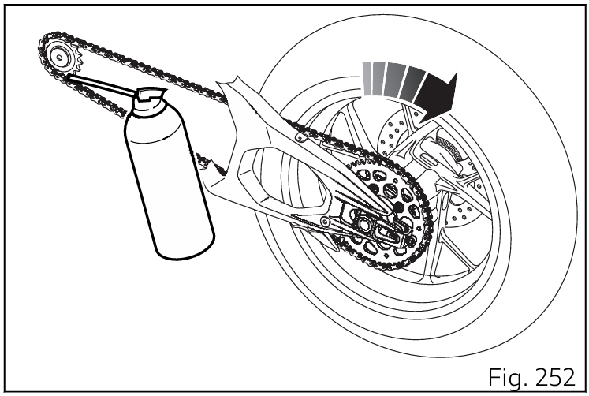
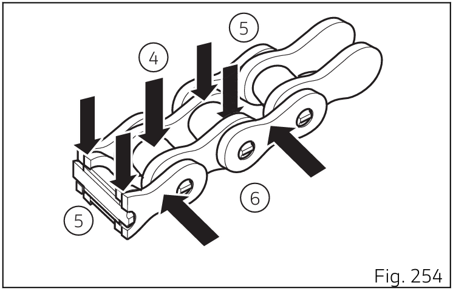

# Chaîne de transmission
## Contrôle de la tension de la chaîne de transmission
Tourner la roue arrière pour trouver la position dans laquelle la chaîne est plus tendue. Placer le motocycle sur sa béquille latérale. Par une simple pression du doigt, pousser la chaîne vers le bas dans le point de mesure, puis relâcher la chaîne.

Mesurer la distance (A) entre le centre des axes de la chaîne et le plastique du patin de chaîne, qui doit être : A = (21 ÷ 23) mm (0.83 ÷ 0.90 in).

## Graissage de la chaîne
Pour le graissage de la chaîne utiliser SHELL Advance Chain ; Graisser la chaîne (5) sans attendre son refroidissement après usage, afin que le nouveau lubrifiant puisse mieux pénétrer parmi les maillons
internes et externes et donc offrir une protection plus efficace.
Positionner la moto sur la béquille de stand arrière.
Tourner rapidement la roue arrière dans le sens opposé à celui de marche.

Appliquer le jet de lubrifiant (1) à l’intérieur de la chaîne entre les maillons intérieurs et extérieurs, au point (2) juste avant celui de l’engrènement sur le pignon. Le lubrifiant, à l’état fluide grâce aux solvants du spray, sera soumis à la force centrifuge et donc distribué sur la zone de travail entre l’axe et la douille, en assurant un graissage optimal. Répéter l’opération en orientant le jet de lubrifiant sur la partie centrale (5) de la chaîne de sorte à graisser les rouleaux (4) et sur les plaques extérieures (6) comme la figure le montre

Une fois le graissage complété, attendre 10-15 minutes pour laisser le lubrifiant agir sur les surfaces internes et externes de la chaîne et ensuite éliminer le lubrifiant excédentaire à l’aide d’un chiffon propre.
Contrôler fréquemment la chaîne, en veillant à la graisser, au moins tous les 1000 km ou plus fréquemment (tous les 400 km environ) en cas d’utilisation de la moto aux températures extérieures élevées (40 °C) ou bien après de longs voyages sur l'autoroute à vitesse élevée 