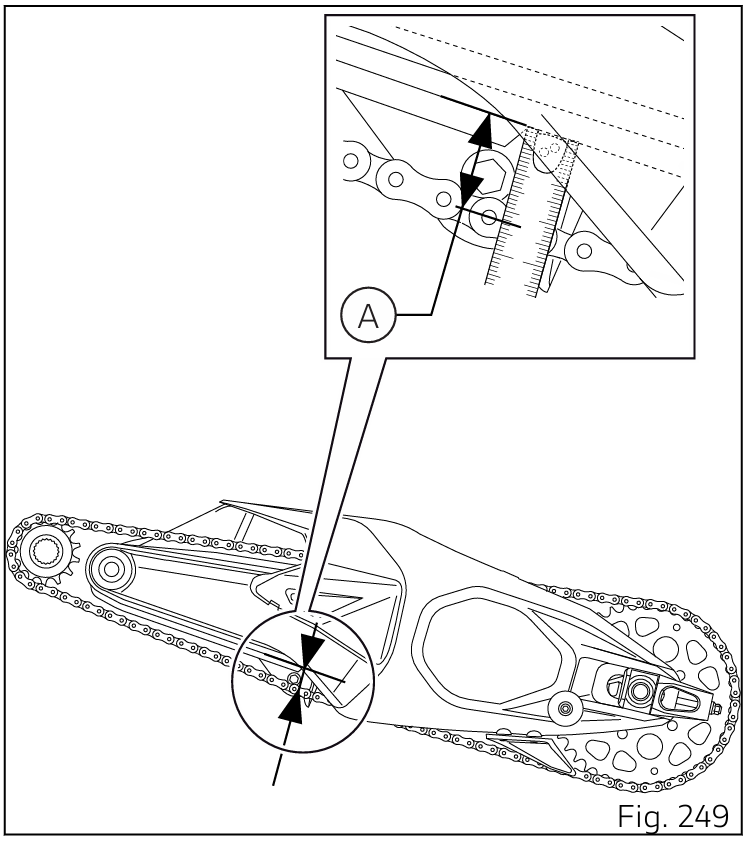

# Chaîne de transmission
## Contrôle de la tension de la chaîne de transmission
Tourner la roue arrière pour trouver la position dans laquelle la chaîne est plus tendue. Placer le motocycle sur sa béquille latérale. Par une simple pression du doigt, pousser la chaîne vers le bas dans le point de mesure, puis relâcher la chaîne.

Mesurer la distance (A) entre le centre des axes de la chaîne et le plastique du patin de chaîne, qui doit être : A = (21 ÷ 23) mm (0.83 ÷ 0.90 in).

## Graissage de la chaîne
Pour le graissage de la chaîne utiliser SHELL Advance Chain ; Graisser la chaîne (5) sans attendre son refroidissement après usage, afin que le nouveau lubrifiant puisse mieux pénétrer parmi les maillons
internes et externes et donc offrir une protection plus efficace.
Positionner la moto sur la béquille de stand arrière.
Tourner rapidement la roue arrière dans le sens opposé à celui de marche.