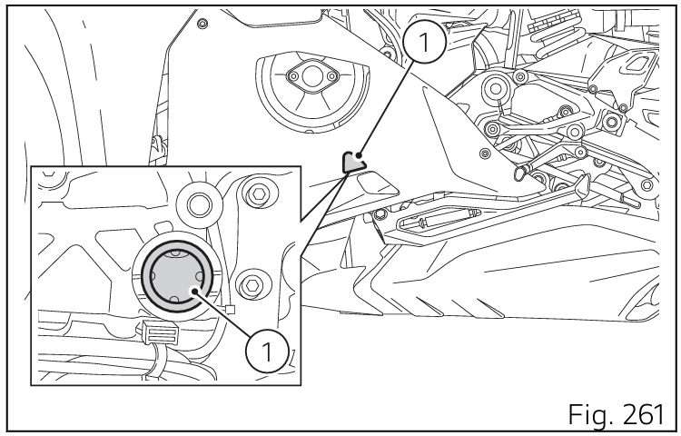
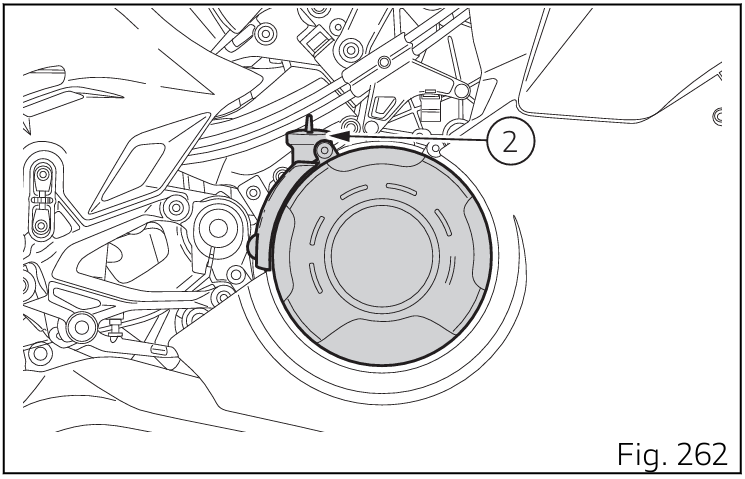

Contrôle du niveau d'huile moteur
• Le niveau doit être vérifié lorsque le moteur est chaud, environ 15 minutes après que le moteur a été arrêté.  Couper le moteur et attendre de 10 à 15 minutes pour permettre à toute l'huile de regagner le carter.
• Positionner la moto sur un terrain plat avec les deux roues posées sur le sol et en position verticale.

Le niveau de l'huile moteur peut être vérifié par le hublot de regard (1) placé du côté gauche du carter. Le niveau d'huile doit se situer entre les repères du regard transparent.   Si le niveau de l'huile est au-dessous du milieu des deux repères MIN et MAX, ajouter de l'huile jusqu'à atteindre le repère MAX.

Ducati prescrit l'utilisation de l'huile SAE 15W-50/ JASO MA2 uniquement et suggère l'utilisation de l'huile Shell Advance DUCATI 15W-50 Fully Synthetic Oil.

1. Enlever le bouchon de remplissage (2), positionné du côté droit du véhicule
2. Ajouter de l’huile jusqu'au niveau établi.
3. Contrôler le niveau de l'huile moteur par le hublot de regard
4. Reposer le bouchon de remplissage.

