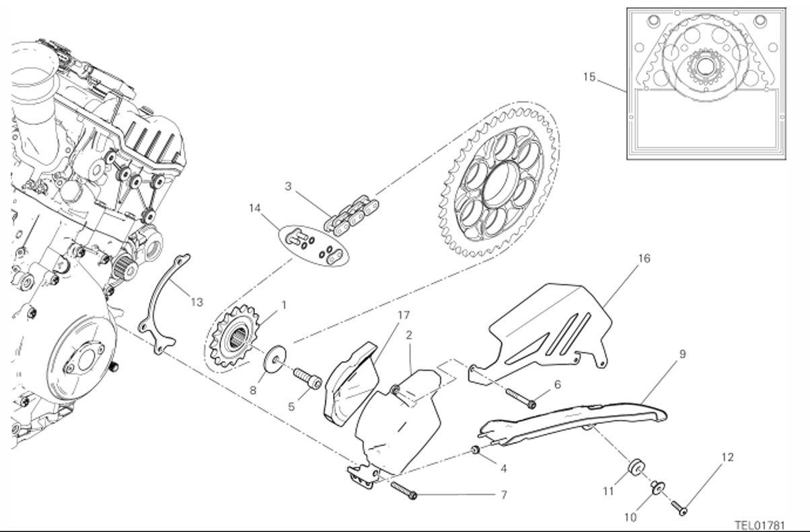

|APPLICATION                                                                 |Q.TY|THREAD (MM) |TORQUE (NM) # 10%                                    |NOTES                             |
|----------------------------------------------------------------------------|----|------------|-----------------------------------------------------|----------------------------------|
|Fastener to secondary                                                       |1   |M10         |55*                                                  |GREASE B                          |
|Sprocket cover fastener                                                     |1   |M6          |10                                                   |                                  |
|Cover, metal sheet and slave cylinder to engine block retainer              |1   |M6          |10                                                   |                                  |
|Chain splash guard to silencer cover retainers                              |1   |M5          |4                                                    |                                  |

|POS. |CODE |DESCRIPTION| QUANT. |VALIDITÉ |REMARQUES|
|-|-|-|-|-|-|
|1| 44910801B| PIGNON| CHAINE |D16| 1||
|2| 4601R941A |COUVERCLE PIGNON CHAINE| 1||
|3| 67641371A| CHAÎNE| 115+1| 1 |XST:BLG,EUR,JPN,GSO,VNZ|
|4| 76440561A| CAOUTCHOUC |2||
|5| 77154337C |VIS| 1||
|6| 77156683B |VIS |1||
|7| 77156733B |VIS |1||
|8 |85212801A| RONDELLE DE BUTEE |1||
|9 |46017431A| BAVETTE GARDE-BOUE |1||
|10| 71611671AA| ENTRETOISE| 1||
|11| 76411501A| CAOUTCHOUC| 1||
|12| 77244213B| VIS TBEI M5X20| 1||
|13| 44712181A| GLISSIERE| 1||
|14| 67740033A |JOINT CHAIN |1||
|15| 67621381A| KIT TRANSMISSION SECONDAIRE| 1| XST:BLG,EUR,JPN,GSO,VNZ|
|16| 48613281A |||
