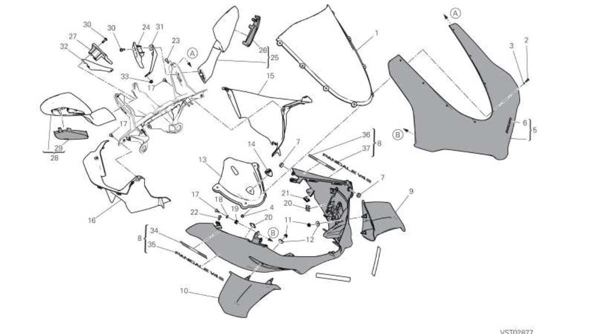

|REFERENCE|APPLICATION                                                                 |Q.TY|THREAD (MM) |TORQUE (NM) # 10%                                    |NOTES                             |
|---|----------------------------------------------------------------------------|----|------------|-----------------------------------------------------|----------------------------------|
| |Upper headlight fairing/subframe/headlight fastener                         |2   |M5          |2.5                                                  |                                  |
| |Subframe to rear headlight fairing fastener                                 |2   |M5          |-                                                    |                                  |
| 77510071AB |Windscreen to headlight fairing fastener (vis de bulle)          |8   |M4          |0.2                                                  |                                  |
| |Lower to upper headlight fairing fastener                                   |2   |M5          |2.5                                                  |                                  |
| |Lower headlight fairing (cowlings) to headlight fastener                    |4   |M5          |-                                                    |                                  |
| |Lower headlight fairing to upper half fairing fastener                      |2   |M5          |2.5                                                  |                                  |
| |LH cowling to headlight fairing fastener                                    |2   |M5          |5                                                    |                                  |
| |RH cowling to headlight fairing fastener                                    |2   |M5          |5                                                    |                                  |

|APPLICATION                                                                 |Q.TY|THREAD (MM) |TORQUE (NM) # 10%                                    |NOTES                             |
|----------------------------------------------------------------------------|----|------------|-----------------------------------------------------|----------------------------------|
|Fastener securing tank LH side cover to tank                                |1   |M5          |2.5                                                  |                                  |
|Fastener securing tank RH side cover to tank                                |1   |M5          |2.5                                                  |                                  |

|APPLICATION                                                                 |Q.TY|THREAD (MM) |TORQUE (NM) # 10%                                    |NOTES                             |
|----------------------------------------------------------------------------|----|------------|-----------------------------------------------------|----------------------------------|
|LH lower fairing to silencer cover fastener                                 |3   |Self-tapping|                                                     |                                  |
|LH lower half fairing to LH upper half fairing fastener                     |1   |M5          |2.5                                                  |                                  |
|Lower LH half fairing to Rad Duct fastener                                  |2   |M5          |2.5                                                  |                                  |
|LH lower half fairings to fastener (bollhoff)                               |1   |M6          |2.9                                                  |                                  |
|LH lower half fairing to support fastener                                   |1   |M5          |6                                                    |GREASE M                          |

|APPLICATION                                                                 |Q.TY|THREAD (MM) |TORQUE (NM) # 10%                                    |NOTES                             |
|----------------------------------------------------------------------------|----|------------|-----------------------------------------------------|----------------------------------|
|Lower half-fairings fastener                                                |2   |M5          |2.5                                                  |                                  |

|APPLICATION                                                                 |Q.TY|THREAD (MM) |TORQUE (NM) # 10%                                    |NOTES                             |
|----------------------------------------------------------------------------|----|------------|-----------------------------------------------------|----------------------------------|
|RH lower fairing to silencer cover fastener                                 |3   |Self-tapping|-                                                    |                                  |
|RH lower half fairing to RH upper half fairing fastener                     |1   |M5          |2.5                                                  |                                  |
|Lower RH half fairing to Rad Duct fastener                                  |2   |M5          |2.5                                                  |                                  |
|RH lower half fairings to fastener (bollhoff)                               |1   |M6          |2.9                                                  |                                  |
|RH lower half fairing to support fastener                                   |1   |M5          |6                                                    |GREASE M                          |

|APPLICATION                                                                 |Q.TY|THREAD (MM) |TORQUE (NM) # 10%                                    |NOTES                             |
|----------------------------------------------------------------------------|----|------------|-----------------------------------------------------|----------------------------------|
|LH panel to upper half fairing fastener  (flan gauche vers demi-flan superieur gauche) |1   |M5          |2.5                                                  |                                  |
|LH panel to headlight subframe fastener  (flan gauche vers sub frame phares)  |1   |M5          |2.5                                                  |                                  |
|RH panel to upper half fairing fastener  (flan droit vers demi-flan superieur gauche) |1   |M5          |2.5                                                  |                                  |
|RH panel to headlight subframe fastener  (flan gauche vers sub frame phares) |1   |M5          |2.5                                                  |                                  |
|Double-sided adhesive tape on tank cover LH attachment                      |1   |            |                                                     |                                  |
|Double-sided adhesive tape on tank cover RH attachment                      |1   |            |                                                     |                                  |
|Tank cover to tank fastener (Couvercle de reservoir sur fixation de reservoir) |2   |M5          |2.5                                                  |                                  |
|LH rear head cover to rear head cover fastener                              |2   |M5          |2.5                                                  |                                  |
|Head cover to wiring support fastener                                       |2   |M5          |-                                                    |                                  |

|APPLICATION                                                                 |Q.TY|THREAD (MM) |TORQUE (NM) # 10%                                    |NOTES                             |
|----------------------------------------------------------------------------|----|------------|-----------------------------------------------------|----------------------------------|
|Tail guard cover to LH side body panel (bollhoff) fastener                  |1   |            |-                                                    |                                  |
|Side body panel to lower tail guard cover (bollhoff) fastener               |1   |            |-                                                    |                                  |
|LH tail guard side body panels to subframe fastener                         |1   |M5          |2.5                                                  |                                  |
|Tail guard side body panels to compartment fastener                         |1   |M5          |2.5                                                  |                                  |
|Tail guard cover to RH side body panel (bollhoff) fastener                  |1   |            |-                                                    |                                  |
|Side body panel to lower tail guard cover (bollhoff) fastener               |1   |            |-                                                    |                                  |
|RH tail guard side body panels to subframe fastener                         |1   |M5          |2.5                                                  |                                  |
|Tail guard side body panels to compartment fastener                         |1   |M5          |2.5                                                  |                                  |
|Tail guard side body panels to tank fastener                                |1   |M5          |-                                                    |                                  |
|Tail guard lower cover to rear subframe fastener                            |2   |M5          |4                                                    |                                  |
|Tail guard lower cover to tail guard compartment fastener                   |1   |M5          |4                                                    |                                  |
|Tail guard cover to side body panel fastener                                |2   |M5          |2.5                                                  |                                  |
|Gearbox cover to clutch cover fastener                                      |2   |M5          |3                                                    |                                  |
|Tail guard cover to single-seater tail guard (bollhoff) fastener            |2   |M6          |-                                                    |                                  |
|Upper half fairings to headlight fairing fastener                           |2   |M5          |2.5                                                  |                                  |
|Lower half fairing to Rad Duct retainer                                     |2   |M5          |-                                                    |                                  |
|Headlight fairing to subframe fastener                                      |2   |M5          |5                                                    |                                  |
