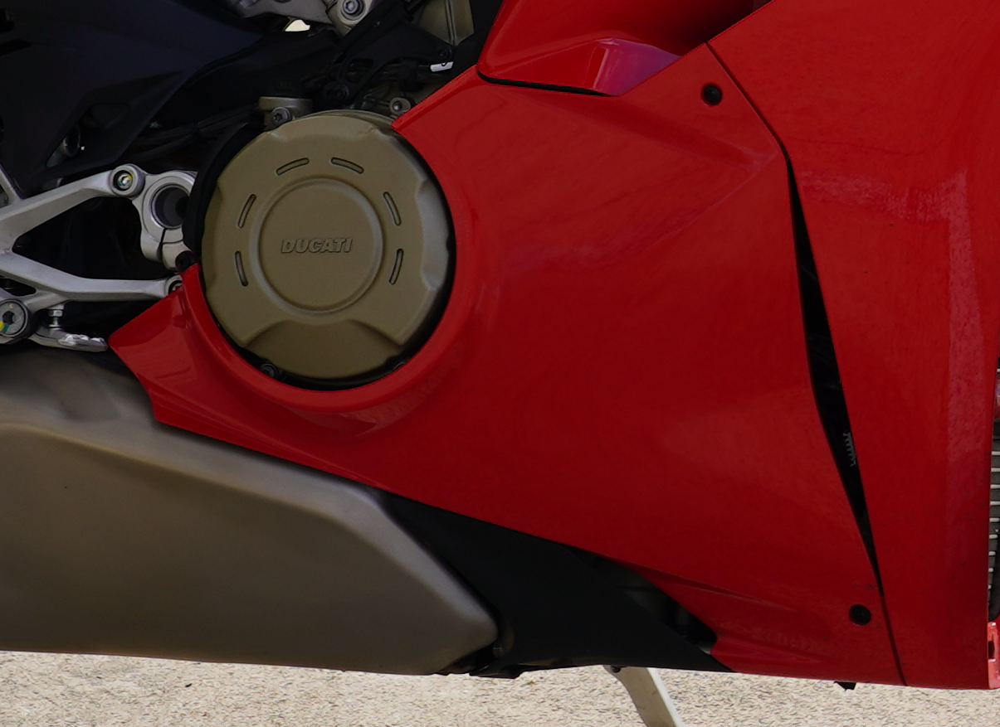

# Demi Carénage Droit

|REFERENCE|APPLICATION                                                                 |Q.TY|THREAD (MM) |TORQUE (NM) # 10%                                    |NOTES                             |
| --- |----------------------------------------------------------------------------|----|------------|-----------------------------------------------------|----------------------------------|
| |RH half fairing to frame (bollhoff) fastener (Demi Carénage Droit sur Cadre  (bollhoff) ) |1   | M6 | 2.9 | |
| 77214411AA ? |RH half fairing to frame fastener (Demi Carénage Droit) | 1 | M5 | 5 | |
| |Upper RH half fairing to Rad Duct fastener (Demi Carénage Droit sur Conduit d'Air Radiateur) | 1 | M5 | 2.5 | |
