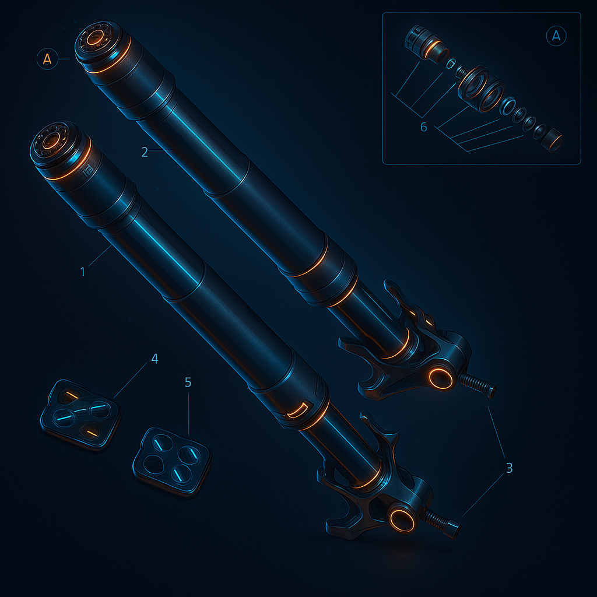

|APPLICATION                                                                 |Q.TY|THREAD (MM) |TORQUE (NM) # 10%                                    |NOTES                             |
|----------------------------------------------------------------------------|----|------------|-----------------------------------------------------|----------------------------------|
|Dowel to bottom yoke fastener (Fixation de goupille sur té inférieur)                                              |2   |M6          |10                                                   |LOCK 2                            |
|Steering ring nut tightening                                                |1   |M35         |35*                                                  |GREASE D                          |
|Steering head on forks tightening                                           |2   |M8          |18*                                                  |GREASE B (On thread only)         |
|Steering head clamp tightening                                              |6   |M8          |18*                                                  |GREASE M (On thread and underhead)|
|Wheel shaft clamp tightening                                                |4   |M8          |19*                                                  |GREASE B                          |
|Steering head clamp on forks tightening                                     |4   |M8          |18*                                                  |GREASE B (On thread only)         |
|Bottom yoke splash guard tightening                                         |3   |M5          |5                                                    |Pre-applied threadlocker          |
|Cat's eye to bracket tightening                                             |2   |M5          |3                                                    |                                  |
|Öhlins steering damper eyelet fastener                                      |1   |M8          |10*                                                  |LOCK 5                            |
|Steering damper to frame fastener                                           |1   |M6          |10                                                   |Pre-applied threadlocker          |
|Steering damper to handlebar fastener                                       |1   |M6          |10                                                   |LOCK 1                            |
