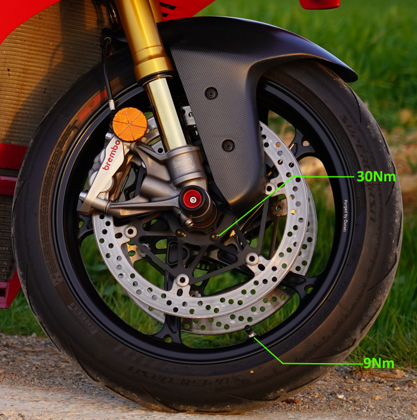

|APPLICATION |Q.TY|THREAD (MM) |TORQUE (NM) # 10%                                    |NOTES                             |
|--------------------------------------|----|------------|-----------------------------------------------------|----------------------------------|
|Front brake discs to front rim retainer (Disques de frein avant sur fixation de jante avant)| 10  |M8 |30* |Pre-applied threadlocker          |
|Wheel shaft fastener (Fixation de l’axe de roue)|1   |M25         |63*                                                  |GREASE B (On thread and underhead)|
|Valve to front wheel fastener (Fixation de la valve sur la roue avant)|1   |M25         |9 | |
|*dynamic safety-critical point; tightening torque tolerance must be Nm ‡ 5%. (point de sécurité dynamique critique ; la tolérance du couple de serrage doit être de Nm ‡ 5 %.)|    | | |                                  |
