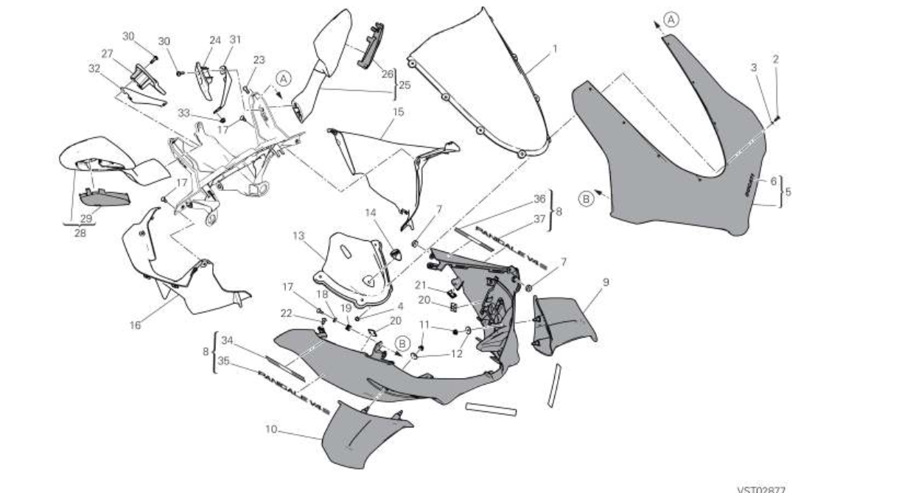

| REFERENCE  | APPLICATION | Q.TY | THREAD (MM) | TORQUE (NM) # 10% | NOTES |
| ---------- | -------------------------------------------------------------------------------------------------------------------------- | ---- | ----------- | ----------------- | ----- |
|            | Upper headlight fairing/subframe/headlight fastener (Fixation coiffe de phare / sous-cadre / phare)                        | 2    | M5          | 2.5               |       |
|            | Subframe to rear headlight fairing fastener (Fixation sous-cadre à coiffe arrière de phare)                              | 2    | M5          | -                 |       |
| 77510071AB | Windscreen to headlight fairing fastener (Fixation bulle à coiffe de phare (vis de bulle))                                | 8    | M4          | 0.2               |       |
|            | Lower to upper headlight fairing fastener (Fixation coiffe inférieure à coiffe supérieure de phare)                     | 2    | M5          | 2.5               |       |
|            | Lower headlight fairing (cowlings) to headlight fastener (Fixation coiffe inférieure de phare (carénages) au phare)      | 4    | M5          | -                 |       |
|            | Lower headlight fairing to upper half fairing fastener (Fixation coiffe inférieure de phare à demi-carénage supérieur) | 2    | M5          | 2.5               |       |
|            | LH cowling to headlight fairing fastener (Fixation coiffe gauche (LH) à coiffe de phare)                                  | 2    | M5          | 5                 |       |
|            | RH cowling to headlight fairing fastener (Fixation coiffe droite (RH) à coiffe de phare)                                  | 2    | M5          | 5                 |       |

| APPLICATION                  | Q.TY | THREAD (MM) | TORQUE (NM) # 10% | NOTES |
| ---------------------------- | ---- | ----------- | ----------------- | ----- |
| Lower half-fairings fastener | 2    | M5          | 2.5               |       |

| APPLICATION                                                                            | Q.TY | THREAD (MM) | TORQUE (NM) # 10% | NOTES |
| -------------------------------------------------------------------------------------- | ---- | ----------- | ----------------- | ----- |
| Double-sided adhesive tape on tank cover LH attachment                                 | 1    |             |                   |       |
| Double-sided adhesive tape on tank cover RH attachment                                 | 1    |             |                   |       |
| Tank cover to tank fastener (Couvercle de reservoir sur fixation de reservoir)         | 2    | M5          | 2.5               |       |
| LH rear head cover to rear head cover fastener                                         | 2    | M5          | 2.5               |       |
| Head cover to wiring support fastener                                                  | 2    | M5          | -                 |       |

| APPLICATION                                                                                                        | Q.TY | THREAD (MM) | TORQUE (NM) # 10% | NOTES |
| ------------------------------------------------------------------------------------------------------------------ | ---- | ----------- | ----------------- | ----- |
| Upper half fairings to headlight fairing fastener (Fixation des demi-carénages supérieurs à la coiffe de phare) | 2    | M5          | 2.5               |       |
| Lower half fairing to Rad Duct retainer (Fixation du demi-carénage inférieur au support du conduit de radiateur) | 2    | M5          | -                 |       |
| Headlight fairing to subframe fastener (Fixation de la coiffe de phare au sous-cadre)                              | 2    | M5          | 5                 |       |

 ## Tableau 37A - Capot Avant
| SKU       | Tableau | Index | Instance Id | Id       | Nom                                      |Q.TY| Type  | Dimensions | TORQUE (NM) # 10% | Custom |
| --------- | ------- | ----- | ----------- | -------- | ---------------------------------------- | ----|----- | ---------- | ------- |------- |
| 77214411BA | 37A     | 17    | LH           | 37A-17-LH | Air Duct to CHassis/Instru   |  2    |       |    M5X12        |    |  Std |
| 77214411BA | 37A     | 17    | RH           | 37A-17-RH | Air Duct to CHassis/Instru   |  2    |       |    M5X12        |    |  Std |

| APPLICATION                                                                            | Q.TY | THREAD (MM) | TORQUE (NM) # 10% | NOTES |
| -------------------------------------------------------------------------------------- | ---- | ----------- | ----------------- | ----- |
| LH panel to upper half fairing fastener  (flan gauche vers demi-flan superieur gauche) | 1    | M5          | 2.5               |       |
| LH panel to headlight subframe fastener  (flan gauche vers sub frame phares)           | 1    | M5          | 2.5               |       |
| RH panel to upper half fairing fastener  (flan droit vers demi-flan superieur gauche)  | 1    | M5          | 2.5               |       |
| RH panel to headlight subframe fastener  (flan gauche vers sub frame phares)           | 1    | M5          | 2.5               |       |