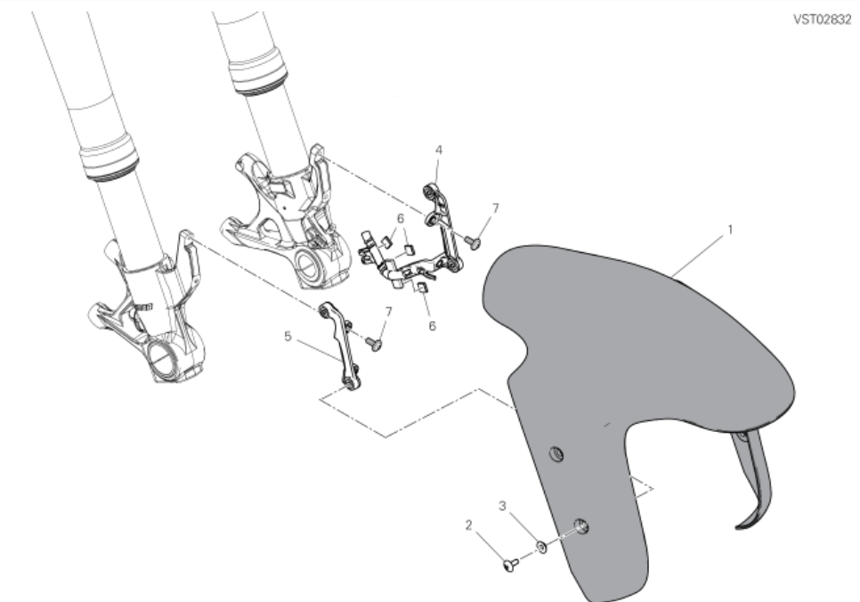

# Couples de Serrage - Garde Boue Avant

## Tableau 24A - Garde-Boue Avant

| SKU        | Tableau | Index | Instance Id      | Id        | Nom                                                                                                     | Q.TY | Type | Dimensions | TORQUE (NM) # 10% | Custom                   |
| ---------- | - | ----- | ---------------- | --------- | - | ---- | ---- | ---------- | ----------------- | ------------------------ |
| 77210893B  |         |       |                  |           | Mudguard brackets to fork axle lugs fastener (support de garde boue sur les supports de fourche) | 4    |      | M6         | 8 | Pre-applied threadlocker |
| 77244183BA | 24A| 2 | Left Hand, High  | 24A-2-LHH | Vis Garde Boue Avant, Gauche, Haute, sur support de garde boue (Front mudguard to brackets fastener)  | 4    | TBEI | M5X14      | 6                 | |
| 77244183BA | 24A| 2 | Left Hand, Low   | 24A-2-LHL | Vis Garde Boue Avant, Gauche, Basse, sur support de garde boue (Front mudguard to brackets fastener) | 4    | TBEI | M5X14      | 6                 | |
| 77244183BA | 24A| 2 | Right Hand, High | 24A-2-RHH | Vis Garde Boue Avant, Droite, Haute, sur support de garde boue (Front mudguard to brackets fastener)  | 4    | TBEI | M5X14      | 6                 | |
| 77244183BA | 24A| 2 | Right Hand, Low  | 24A-2-RHL | Vis Garde Boue Avant, Droite, Basse, sur support de garde boue (Front mudguard to brackets fastener)   | 4    | TBEI | M5X14      | 6                 | |
|  | |  | Left Hand  | LH | Vis maintien durite de frein sur Garde Boue Avant, Gauche| 2 |  | M4x10mm | 1 +- | |
|  | |  | Right Hand  | RH | Vis Garde Boue Avant, Droite, Basse, sur support de garde boue (Front mudguard to brackets fastener)   | 2 |  | M4x10mm | 1  +- | |
## Procédure de démontage du Garde Boue avant
### Outils
 clé 6 pan 2.5mm
 Temps 30 mins les petites vis du modèle FullSix sont compliquées a mettre

### Démonter
1. Dévisser 24A-2-LHH, 24A-2-LHL 24A-2-RHH, 24A-2-RHL (Garde boue sur support de garde boue)
2. Dévisser 20B-16-LH & 20B-16-RH, clé 6 pan 2.5mm (durites/garde boue)

## Remonter
1. visser 20B-16-LH & 20B-16-RH, M4x10mm, clé 6 pan 2.5mm (durites/garde boue)
2. visser 24A-2-LHH, 24A-2-LHL 24A-2-RHH, 24A-2-RHL (Garde boue sur support de garde boue)