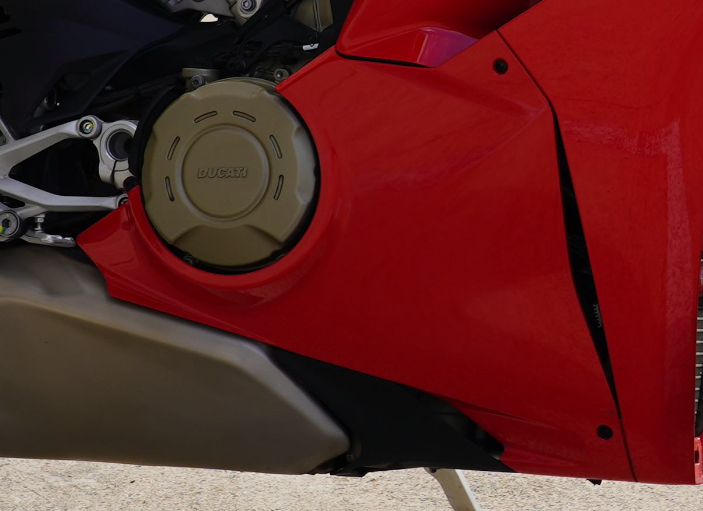

# Demi Carénage Inférieur Droit (DEMI-CARENE INFERIEUR DROITE)

|REFERENCE|APPLICATION                                                                 |Q.TY|THREAD (MM) |TORQUE (NM) # 10%                                    |NOTES                             |
| --- |----------------------------------------------------------------------------|----|------------|-----------------------------------------------------|----------------------------------|
| |RH half fairing to frame (bollhoff) fastener (Demi Carénage Droit sur Cadre  (bollhoff) ) |1   | M6 | 2.9 | |
| 77214411AA ? |RH half fairing to frame fastener (Demi Carénage Droit sur Fixation de Cadre) | 1 | M5 | 5 | |
| 77211091C ? |Upper RH half fairing to Rad Duct fastener (Demi Carénage Droit sur Conduit d'Air Radiateur) | 1 | M5 | 2.5 | |

|APPLICATION                                                                 |Q.TY|THREAD (MM) |TORQUE (NM) # 10%                                    |NOTES                             |
|----------------------------------------------------------------------------|----|------------|-----------------------------------------------------|----------------------------------|
|RH lower fairing to silencer cover fastener (Fixation du carénage inférieur droit sur le cache silencieux) |3   |Self-tapping|-                                                    |                                  |
|RH lower half fairing to RH upper half fairing fastener (Fixation du demi-carénage inférieur droit au demi-carénage supérieur droit) |1   |M5          |2.5 | |
|Lower RH half fairing to Rad Duct fastener (Fixation du demi-carénage inférieur droit au conduit de radiateur) |2   |M5          |2.5                                                  |                                  |
|RH lower half fairings to fastener (bollhoff) (Fixation des demi-carénages inférieurs droits (Bollhoff)) |1   |M6          |2.9                                                  |                                  |
|RH lower half fairing to support fastener (Fixation du demi-carénage inférieur droit au support) |1   |M5          |6 |GREASE M                          |
