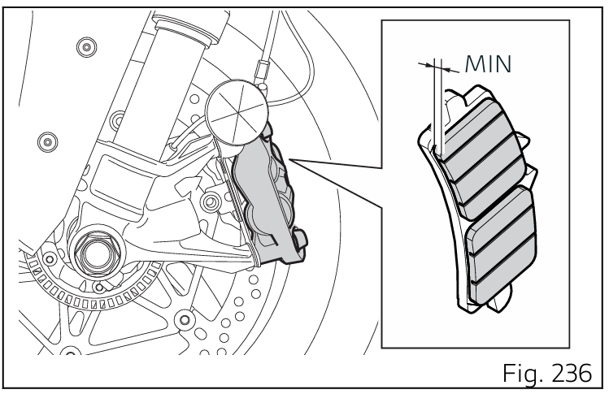
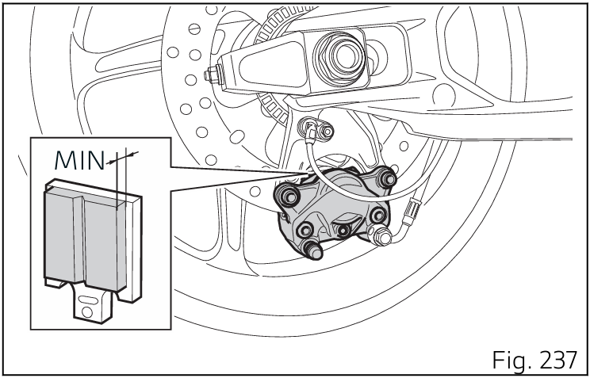

# Contrôle des Freins

Contrôler l'usure des plaquettes à travers l'ouverture obtenue entre les demi-étriers. Si l'épaisseur de la garniture, même d'une seule plaquette, est d'environ 1 mm (0,04 in), procéder au remplacement des deux plaquettes.

## Frein Avant

## Frein Arrière

