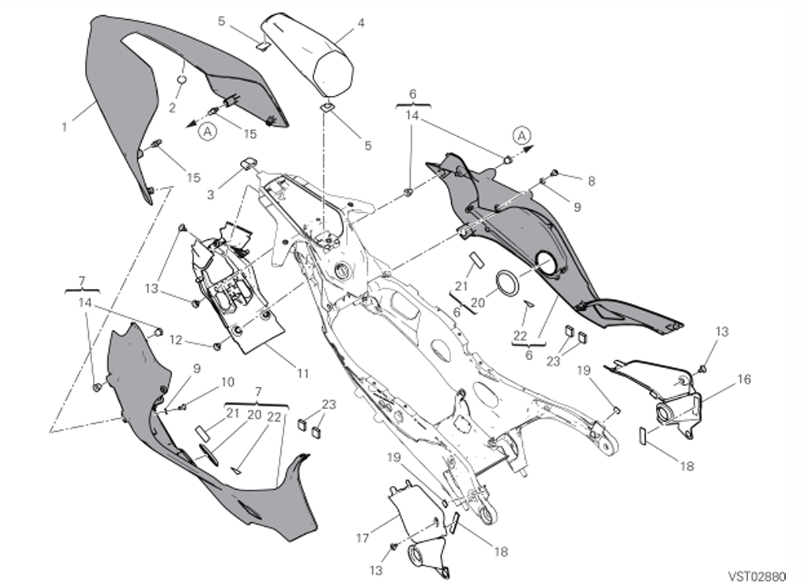

# TABLEAU 37D - QUEUE DE CARENAGE
GROUPE CADRE

|APPLICATION                                                                 |Q.TY|THREAD (MM) |TORQUE (NM) # 10%                                    |NOTES                             |
|----------------------------------------------------------------------------|----|------------|-----------------------------------------------------|----------------------------------|
|Tail guard cover to LH side body panel (bollhoff) fastener (Fixation du capot de protection arrière sur le panneau latéral gauche (Bollhoff)) |1   | |- | |
|Side body panel to lower tail guard cover (bollhoff) fastener (Fixation du panneau latéral sur le capot inférieur de protection arrière (Bollhoff)) |1   |            |- | |
|LH tail guard side body panels to subframe fastener (Fixation des panneaux latéraux gauche de protection arrière au sous-cadre) |1   |M5          |2.5 | |
|Tail guard side body panels to compartment fastener (Fixation des panneaux latéraux de protection arrière au compartiment) |1   |M5          |2.5 | |
|Tail guard cover to RH side body panel (bollhoff) fastener (Fixation du capot de protection arrière sur le panneau latéral droit (Bollhoff)) |1   | |- | |
|Side body panel to lower tail guard cover (bollhoff) fastener (Fixation du panneau latéral sur le capot inférieur de protection arrière (Bollhoff)) |1   |            |- | |
|RH tail guard side body panels to subframe fastener (Fixation des panneaux latéraux droit de protection arrière au sous-cadre) |1   |M5          |2.5                                                  | |
|Tail guard side body panels to compartment fastener (Fixation des panneaux latéraux de protection arrière au compartiment) |1   |M5          |2.5 | |
|Tail guard side body panels to tank fastener (Fixation des panneaux latéraux de protection arrière au réservoir) |1   |M5          |-                                                    | |
|Tail guard lower cover to rear subframe fastener (Fixation du capot inférieur de protection arrière au sous-cadre arrière) |2   |M5          |4 | |
|Tail guard lower cover to tail guard compartment fastener (Fixation du capot inférieur de protection arrière au compartiment protection arrière) |1   |M5          |4                                                    | |
|Tail guard cover to side body panel fastener (Fixation du capot de protection arrière au panneau latéral) |2   |M5          |2.5 | |
|Gearbox cover to clutch cover fastener (Fixation du couvercle de boîte de vitesses au couvercle d’embrayage) |2   |M5          |3 | |
|Tail guard cover to single-seater tail guard (bollhoff) fastener (Fixation du capot de protection arrière au capot monoplace (Bollhoff)) |2   |M6          |-                                                    | |

| SKU       | Tableau | Index | Instance Id | Id       | Nom                                      |Q.TY| Type  | Dimensions | TORQUE (NM) # 10% | Custom |Custom |
| --------- | ------- | ----- | ----------- | -------- | ---------------------------------------- | ----|----- | ---------- | ------- |------- |------- |
| 77244163B | 37D     | 10    | LH           | 37D-10-LH |Queue de Carenage sur Cadre LH  |  2    |   TBEI    |    M5x10        |   ?   |  Std ||
| 77244163B | 37D     | 10    | RH           | 37D-10-RH |Queue de Carenage sur Cadre LH |   2  |  TBEI     |     M5x10       | ?  | Std  ||
| 77244163B | 37D     | 8    |   LH         | 37D-8-LH |Araignée Carbone  en bas |   2  |       |            | ?  |   ||
| 77244163B | 37D     | 8    |   RH         | 37D-8-RH |Araignée Carbone  en bas |   2  |       |            | ?  |   ||

| SKU        | Tableau | Index | Instance Id | Id          | Nom                                                                     | Type  | Dimensions      | Serrage |
| ---------- | ------- | ----- | ----------- | ----------- | ----------------------------------------------------------------------- | ----- | --------------- | ------- |
| 77440631A  | 14B     | 6     | 1           | 14B-6-1     | Vis de fixation de la couvette de support d'instruments au feu arrière |       |                 |         |
