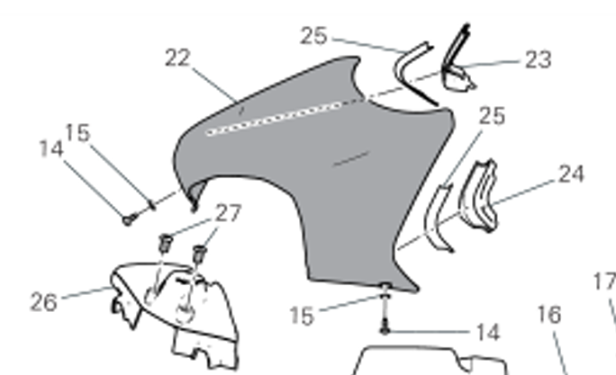

# Tableau 37C Tank Cover

| SKU        | Tableau | Index | Instance Id | Id          | Nom                                                                     | Q.TY|Type  | Dimensions      | TORQUE (NM) # 10%    |Custom |
| ---------- | ------- | ----- | ----------- | ----------- | ----------------------------------------------------------------------- | ----- | ----- | --------------- | ------- |----- | 
|77211091C | 37C | 14 | 1 | 37C-14-1 | Fastener securing tank LH side cover to tank (Fixation du cache latéral gauche de réservoir au réservoir) |1 |TBEI|M5x12 |2.5 | Std |
|77211091C |37C | 14 | 1 | 37C-14-2 | Fastener securing tank RH side cover to tank (Fixation du cache latéral droit de réservoir au réservoir) |1 |TBEI|M5x12 |2.5 | Std |

