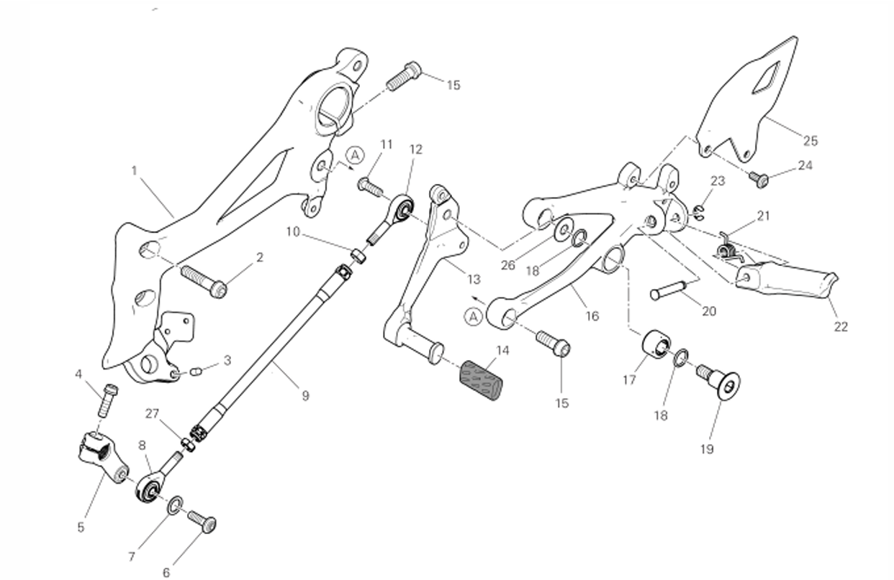

# Tableau 26A Repose Pied Gauche

|APPLICATION                                                                 |Q.TY|THREAD (MM) |TORQUE (NM) # 10%                                    |NOTES                             |
|----------------------------------------------------------------------------|----|------------|-----------------------------------------------------|----------------------------------|
|FOOTPEG, LEVER AND LINKAGE ASSEMBLY                                         |    |            |                                                     |                                  |
|LH footpeg holder plate to stand plate fastener (Fixation de la platine de repose-pied gauche sur la platine de béquille)|2   |M8          |25* |GREASE B |
|Heel guard to LH footpeg fastener (Fixation du protège-talon sur le repose-pied gauche) |2   |M5          |6 |LOCK 2                            |
|Gearchange lever to LH footpeg fastener (Fixation du levier de changement de vitesse sur le repose-pied gauche) |1   |M8          |25 |GREASE D (White Grease) on coll   |
|LH multi-hole plate to support fastener (Fixation de la platine multi-trous gauche sur le support) |2   |M8          | |                                  |
|LH footpeg joint retainer (Retenue de l’articulation du repose-pied gauche) |1   |M5          |                                                     |                                  |
|LH footpeg joint timing pin (Goupille de calage de l’articulation du repose-pied gauche) |1   |            |                                                     |                                  |
|LH footpeg joint fastener (Fixation de l’articulation du repose-pied gauche) |1   |M8          |                                                     |                                  |
|Footpeg holder plate to LH multi-hole plate fastener (Fixation de la platine de repose-pied sur la platine multi-trous gauche) |2   |M8          | |                                  |

## Tableau 26A - Repose Pied Gauche

| SKU       | Tableau | Index | Instance Id | Id       | Nom                                      | Type  | Dimensions | Serrage | Custom |
| --------- | ------- | ----- | ----------- | -------- | ---------------------------------------- | ----- | ---------- | ------- |------- |
| 77244178B | 26A     | 24    | 1           | 26A-24-1 | Pare Talons Gauche - Vis haute         |       |            |         |     |
| 77244178B | 26A     | 24    | 2           | 26A-24-1 | Pare Talons Gauche - Vis basse |       |            |         |     |
| 77157288B | 26A     | 2     | 1           | 26A-2-1  | Vis de commande pied gauche              | TCEIF | M8X35      |         |     |
| 77110191A | 26A     | 4     | 1           | 26A-4-1  | Vis de pince du selecteur de vitesse     | TCEIF | M6X20      |         |     |
| 77157248B | 26A     | 15    | 1           | 26A-3-1  | Vis de pince de la commande pied gauche  | TCEIF | M8X22      |         |     |