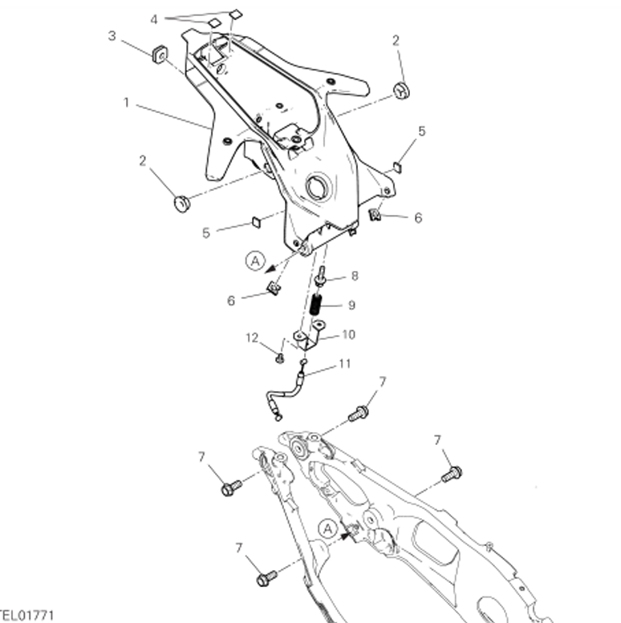

# Porte Couvette

| SKU        | Tableau | Index | Instance Id | Id          | Nom | Type  | Dimensions      | Serrage |
| ---------- | ------- | ----- | ----------- | ----------- | --- | ----- | --------------- | ------- |
| 77440631A  | 14B     | 6     | 1 | 14B-6-1     | Vis de fixation de la couvette de support d'instruments au feu arrière |       | | |

### Remonter - Procédure

Bien penser à fixer le collier au faisceau avant de visser les 4 M8, empreinte de 10, titane Candy
Vérifier le position du cable de retour du loquet de coffre arrière et vérifier que le locquet remonte bien entièrement