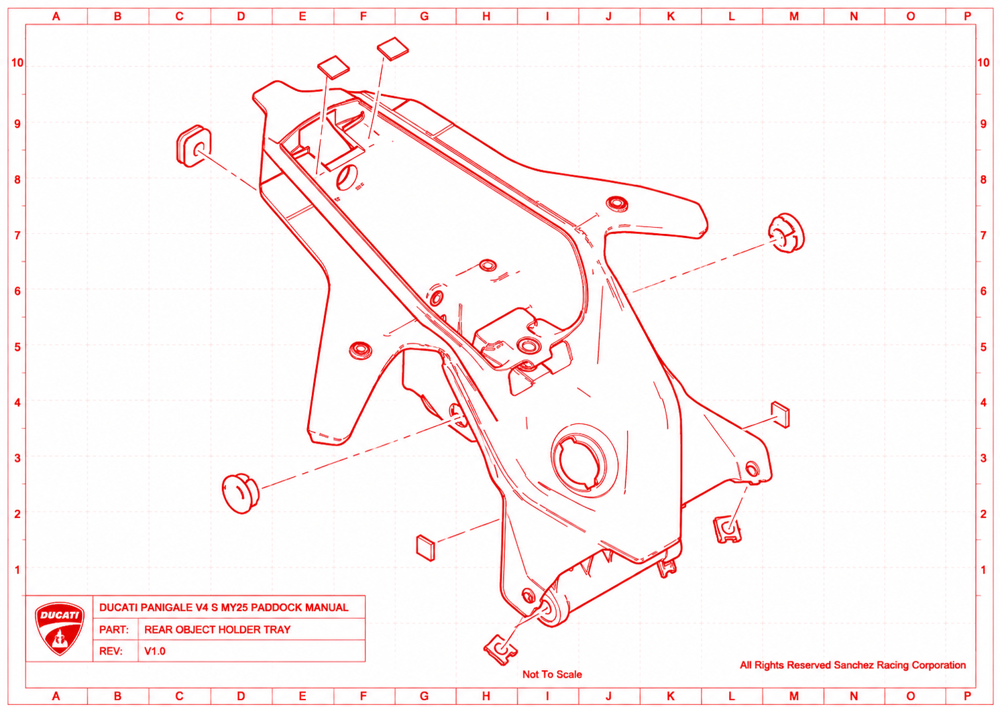

# Porte Couvette

| SKU        | Tableau | Index | Instance Id | Id          | Nom | Type  | Dimensions      | Serrage |
| ---------- | ------- | ----- | ----------- | ----------- | --- | ----- | --------------- | ------- |
| 77440631A  | 14B     | 6     | 1 | 14B-6-1     | Vis de fixation de la couvette de support d'instruments au feu arrière |       | | |

| SKU       | Tableau | Index | Instance Id | Id       | Nom                                      | Type  | Dimensions | Serrage | Custom |Notes |
| --------- | ------- | ----- | ----------- | -------- | ---------------------------------------- | ----- | ---------- | ------- |------- |------- |
| 77251308B | 33C | 7 | 1 | 33C-7-1 | VIS Cadre COUVETTE PORTE-OBJETS | TEF | M8x20 | ?  | No | Frein filet |
| 77251308B | 33C | 7 | 2 | 33C-7-2 | VIS Cadre COUVETTE PORTE-OBJETS | TEF | M8x20 | ?  | No | Frein filet |
| 77251308B | 33C | 7 | 3 | 33C-7-3 | VIS Cadre COUVETTE PORTE-OBJETS | TEF | M8x20 | ?  | No | Frein filet |
| 77251308B | 33C | 7 | 4 | 33C-7-4 | VIS Cadre COUVETTE PORTE-OBJETS | TEF | M8x20 | ?  | No | Frein filet |

### Remonter - Procédure

Bien penser à fixer le collier au faisceau avant de visser les 4 M8, empreinte de 10, titane Candy
Vérifier le position du cable de retour du loquet de coffre arrière et vérifier que le locquet remonte bien entièrement