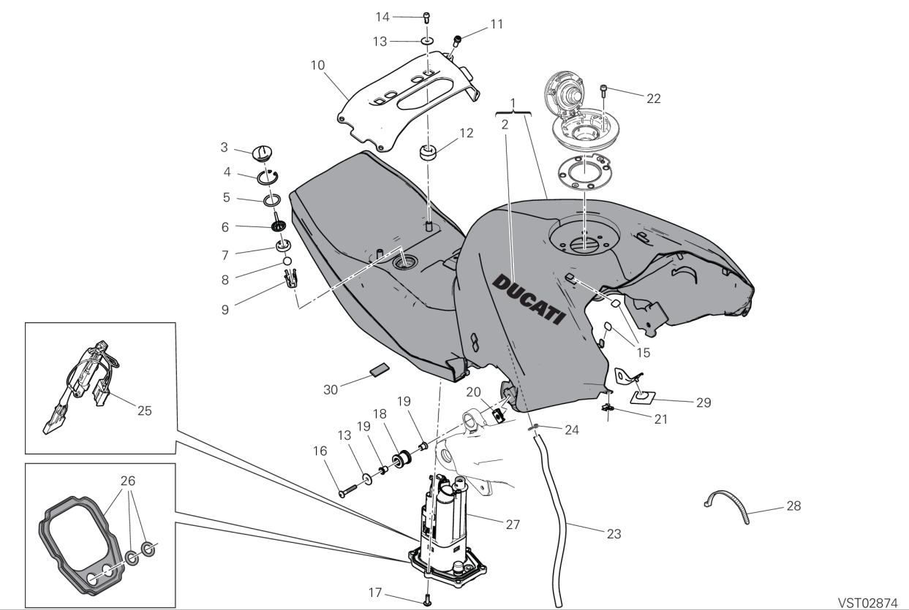

| SKU        | Tableau | Index | Instance Id | Id           | APPLICATION | Q.TY | THREAD (MM) | TORQUE (NM) # 10% | NOTES    |
|-|-|-|-|-| -  | ---- | ----------- | ----------------- | -------- |
|||||| Fixation avant au cadre (Front fastener to frame)  | 2    | M5          | 6                 |          |
|||||| Fixation arrière au support de sous-cadre (Rear fastener to subframe bracket)| 2    | M5          | 6                 |          |
|||||| GAC au dispositif de retenue du réservoir (GAC to tank retainer)| 6    | M5          | 5                 | GREASE B |
|77156418B|30A|22|1|30A-22-1| Fixation du bouchon du réservoir de carburant (Fuel tank plug fastening)| 4    | M5          | 4                 |          |
|77156418B|30A|22|2|30A-22-2| Fixation du bouchon du réservoir de carburant (Fuel tank plug fastening)| 4    | M5          | 4                 |          |
|77156418B|30A|22|3|30A-22-3| Fixation du bouchon du réservoir de carburant (Fuel tank plug fastening)| 4    | M5          | 4                 |          |
|77156418B|30A|22|4|30A-22-4| Fixation du bouchon du réservoir de carburant (Fuel tank plug fastening)| 4    | M5          | 4                 |          |
|||||| Clip YNDAC sur le tuyau de vidange du réservoir (YNDAC clip on tank drain pipe)| 1    |             |                   |          |
|||||| Collier à ressort sur le tuyau réservoir–SENTEC (côté SENTEC) (Spring clamp on tank-SENTEC pipe on (sentec side))                  | 1    |             |                   |          |
|||||| Collier Norma Cobra 10/7 sur le tuyau réservoir–SENTEC (côté réservoir) (Clamp Norma 10/7 cobra on tank-  SENTEC pipe (tank side)) | 1    |             |                   |          |
|||||| Collier à ressort sur le tuyau SENTEC–décanteur (Spring clamp on SENTEC-decanter  pipe )                                             | 2    |             |                   |          |
|||||| Collier Norma Cobra 13/8 sur le tuyau du décanteur (Clamp norma 13/8 cobra on  DECANTER pipe)                                          | 2    |             |                   |          |
|||||| Collier à ressort sur le tuyau décanteur–canister (Spring clamp on decanter-canister  pipe)                                          | 2    |             |                   |          |

|POS.| CODE| DESCRIPTION |QUANT. |
| - | ---- | ----------- | - | 
|1 |58613363AA |RESERVOIR CARBURANT |1|
|2 |43818151C| DECALCOMANIE DUCATI NOIR |2|
|3 |87211343A |BOUCHON| 1|
|4 |88450351A |CIRCLIP |1|
|5 |46320226A |JOINT TORIQUE| 1|
|6 |7131C961A |ENTRETOISE |1|
|7 |79111312A |JOINT |1|
|8 |84740161A |BILLE |1|
|9| 8291H141A |SUPPORT| 1|
|10 |8291R552AA |PLAQUE SUPERIEURE |1|
|11| 77156643B| VIS TCEIF M6X14 8,8 |4|
|12| 76417851A |CAOUTCHOUC| 2|
|13| 85213111AA |RONDELLE| 2|
|14| 77110381A |VIS TCEIF M5X12 |2|
|15| 86613311A| TAMPON CAOUTCHOUC |4|
|16 |71850253C |VIS| 2|
|17 |77244203B| VIS M5X18 |6|
|18 |76414272A |JOINT EN CAOUTCHOUC ANTI-VIBRATION |2|
|19| 7131C881BA |ENTRETOISE| 4|
|20| 85044691A| FIXATION RAPIDE| 2|
|21| 85041951AA |FIXATION RAPIDE |2|
|22| 77156418B |VIS TCEIF M5X16 |4|
|23| 59018911A |TUYAU |1|
|24| 74140431A |COLLIER| 1|
|25 |69928751A |THERMISTOR| 1|
|26| 69926441A |KIT GARNITURE| 1|
|27| 16027111A |POMPE A CARBURANT |1|
|28| 74142461A |COLLIER| 2|
|29 |86610301A |TAMPON |1|
|30| 86612241A |TAMPON CAOUTCHOUC |2|