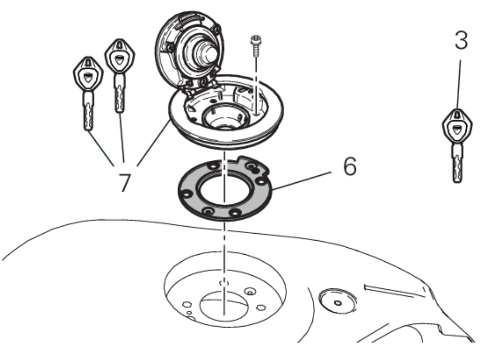

# tank-cap

| APPLICATION | Q.TY | THREAD (MM) | TORQUE (NM) # 10% | NOTES    |
| --------------------------------------------------------------------------------------------------------------------------------------- | ---- | ----------- | ----------------- | -------- |
| Fixation du bouchon du réservoir de carburant (Fuel tank plug fastening)                                                               | 4    | M5          | 4                 |          |

13F

|POS. |CODE| DESCRIPTION |QUANT. |VALIDITÉ |REMARQUES|
|-|-|-|-|-|-|
|1| 59822821AB| GR. SERRURE |1|
|2 |51840051B |ANTENNE IMMOBILIZER| 1|
|3| 59810551B |CLÉ AVEC TRANSPONDEUR ACTIF| 1|
|4 |55219411D |CAPTEUR VITESSE |1|
|5 |65220441A| COMMUTATEUR À CLÉ |1|
|6 |86640081A| JOINT, BOUCHON RESERVOIR ESSENCE| 1|
|7 |89520411AE |BOUCHON DE RESERVOIR COMPLET| 1|
