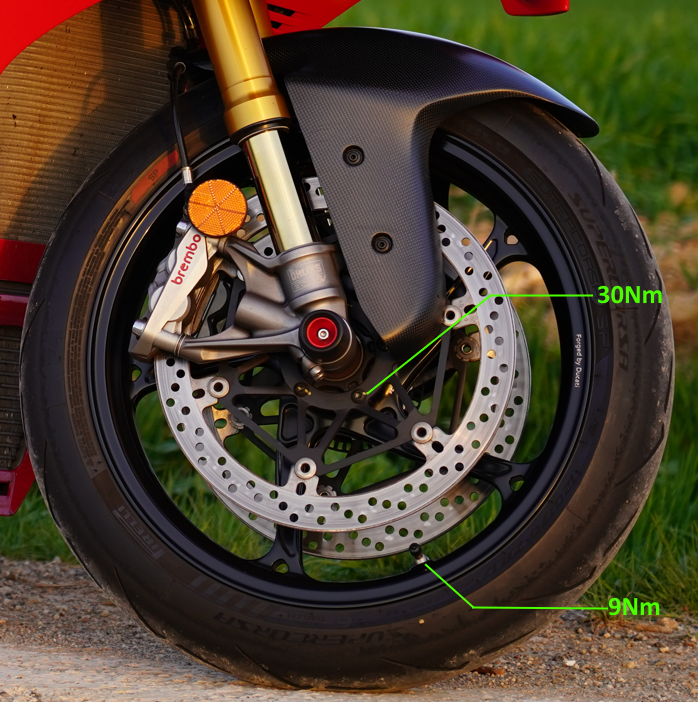
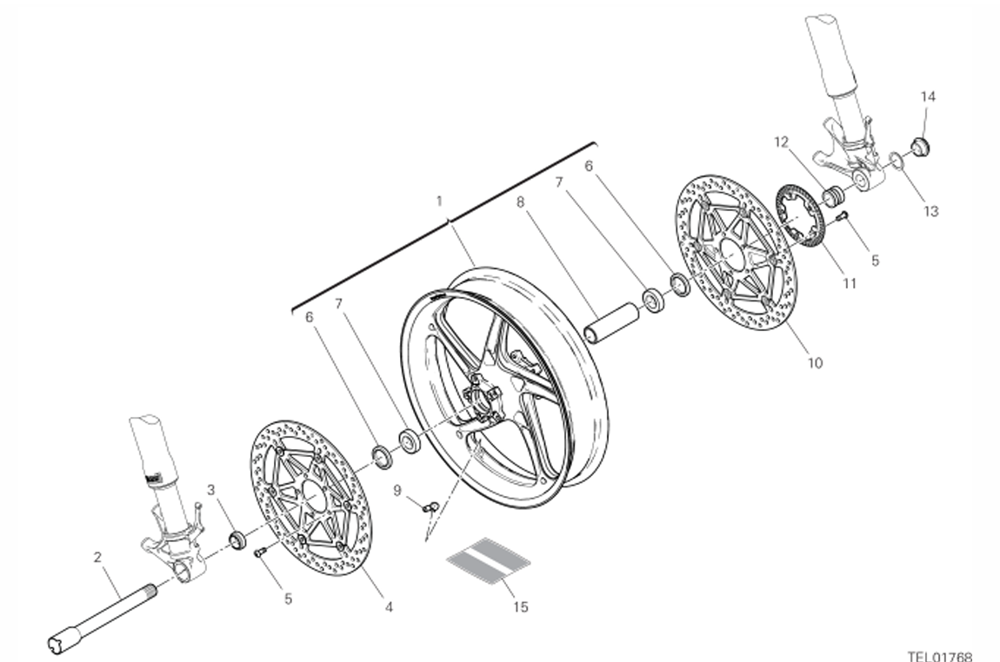

## Tableau 28A - Roue Avant

| SKU       | Tableau | Index | Instance Id | Id       | Nom | Type  | Dimensions | TORQUE (NM) # 10%     | Custom | Notes |
| --------- | ------- | ----- | ----------- | -------- | ---------------------------------------- | ----- | ---------- | ------- |------- |------- |
| 72010513C | 27A     | 5    | 1           | 26B-2-1L | Left Front brake discs to front rim retainer (Disques de frein avant sur fixation de jante avant) |       |            |    30*     |  No ||
| 72010513C | 27A     | 5    | 2           | 26B-2-2L | Left Front brake discs to front rim retainer (Disques de frein avant sur fixation de jante avant) |       |            |     30*    |  No ||
| 72010513C | 27A     | 5    | 3           | 26B-2-3L | Left Front brake discs to front rim retainer (Disques de frein avant sur fixation de jante avant) |       |            |    30*     |  No ||
| 72010513C | 27A     | 5    | 4           | 26B-2-4L | Left Front brake discs to front rim retainer (Disques de frein avant sur fixation de jante avant) |       |            |    30*     |  No ||
| 72010513C | 27A     | 5    | 5           | 26B-2-5L | Left Front brake discs to front rim retainer (Disques de frein avant sur fixation de jante avant) |       |            |   30*      |  No ||
| 72010513C | 27A     | 5    | 1           | 26B-2-1R | Disque de Frein Droit - Vis |       |            |  30*        |  No ||
| 72010513C | 27A     | 5    | 2           | 26B-2-2R | Disque de Frein Droit - Vis |       |            |    30*      |  No ||
| 72010513C | 27A     | 5    | 3           | 26B-2-3R | Disque de Frein Droit - Vis |       |            |   30*       |  No ||
| 72010513C | 27A     | 5    | 4           | 26B-2-4R | Disque de Frein Droit - Vis |       |            |    30*      |  No ||
| 72010513C | 27A     | 5    | 5           | 26B-2-5R | Disque de Frein Droit - Vis |       |            |   30*       |  No ||
||||||Wheel shaft fastener (Fixation de l’axe de roue)|1   |M25         |63*                                               |   |GREASE B (On thread and underhead)|
||||||Valve to front wheel fastener (Fixation de la valve sur la roue avant)|1   |M25         |9 | ||

*dynamic safety-critical point; tightening torque tolerance must be Nm ‡ 5%. (point de sécurité dynamique critique ; la tolérance du couple de serrage doit être de Nm ‡ 5 %.)

