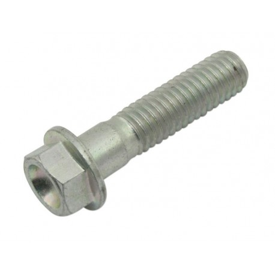
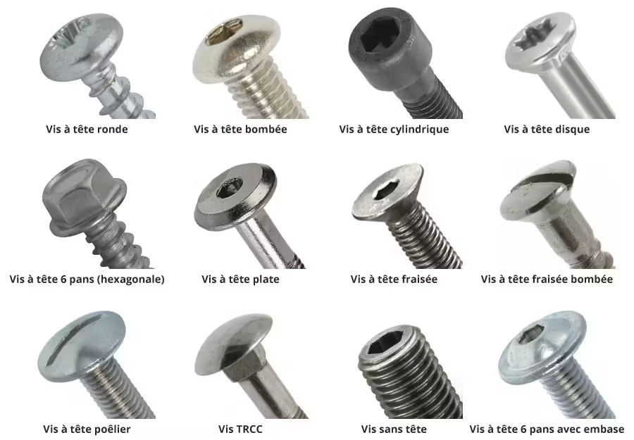

La différence principale entre une vis TBEI et une vis TCEIF réside dans la forme de leur tête et leur application mécanique. 

Une vis TBEI possède une tête bombée large à six pans creux (type ISO 7380), tandis qu'une vis TCEIF correspond à une vis à tête cylindrique (ou parfois fraisée/bombée selon les nomenclatures exactes des constructeurs comme Ducati) à empreinte interne. 

Comparaison des têtes de vis

TBEI (Tête Bombée Empreinte Interne / Six Pans Creux) :
Tête large, basse et arrondie en forme de dôme (button head).Répartit mieux la pression sur les surfaces minces ou esthétiques.Moins saillante qu'une tête cylindrique classique, évite les accrocs.

TCEIF (Tête Cylindrique Étroite / Empreinte Interne) :
Tête haute et verticale de forme cylindrique (type CHC / DIN 912).Permet un couple de serrage puissant et s'utilise dans des logements profonds ou des assemblages structurels soumis à de fortes contraintes.

Une vis TEF désigne généralement une vis à tête fraisée : sa tête conique s’encastre dans un fraisage afin de finir à fleur de surface après serrage. (Boulon)

| Code Ducati | Nom italien                                    | 🇫🇷 Traduction                                       | Empreinte          | Tête                     | Équivalent normalisé courant*      | Clé/Allen typique         |
| ----------- | ---------------------------------------------- | ----------------------------------------------------- | ------------------ | ------------------------ | ---------------------------------- | ------------------------- |
| **TBEI**    | *Testa Bombata Esagono Incassato*              | **Tête bombée à six pans creux**                      | Allen              | Bombée                   | ISO 7380-1                         | M4→3 / M5→4 / M6→4        |
| **TBEIF**   | *Testa Bombata Esagono Incassato Flangiata*    | **Tête bombée à six pans creux avec collerette**      | Allen              | Bombée + collerette      | ISO 7380-2                         | M5→4 / M6→4               |
| **TCEI**    | *Testa Cilindrica Esagono Incassato*           | **Tête cylindrique à six pans creux**                 | Allen              | Cylindrique              | ISO 4762 / DIN 912                 | M4→3 / M5→4 / M6→5 / M8→6 |
| **TCEIF**   | *Testa Cilindrica Esagono Incassato Flangiata* | **Tête cylindrique à six pans creux avec collerette** | Allen              | Cylindrique + collerette | famille ISO 4762 + collerette      | M5→4 / M6→5 / M8→6        |
| **TE**      | *Testa Esagonale*                              | **Tête hexagonale**                                   | Hexagone extérieur | Hexagonale               | DIN 933 / ISO 4017                 | clé/douille               |
| **TEF**     | *Testa Esagonale Flangiata*                    | **Tête hexagonale avec collerette**                   | Hexagone extérieur | Hexagonale + collerette  | ISO 4162                           | douille                   |
| **TS**      | *Testa Svasata*                                | **Tête fraisée**                                      | variable           | Fraisée                  | ISO 10642 selon géométrie          | variable                  |
| **TSCEI**   | *Testa Svasata Esagono Incassato*              | **Tête fraisée à six pans creux**                     | Allen              | Fraisée                  | ISO 10642                          | Allen                     |
| **GR**      | *Grano*                                        | **Vis sans tête / vis de pression**                   | généralement Allen | Sans tête                | ISO 4026/4027/4028/4029 selon bout | Allen                     |

comment appelle t'on les vis qui ont une partie plus large non filetée sous la tête ?

On appelle ça une vis épaulée — ou vis à épaulement.

La partie élargie non filetée sous la tête est l’épaulement (ou shoulder en anglais).