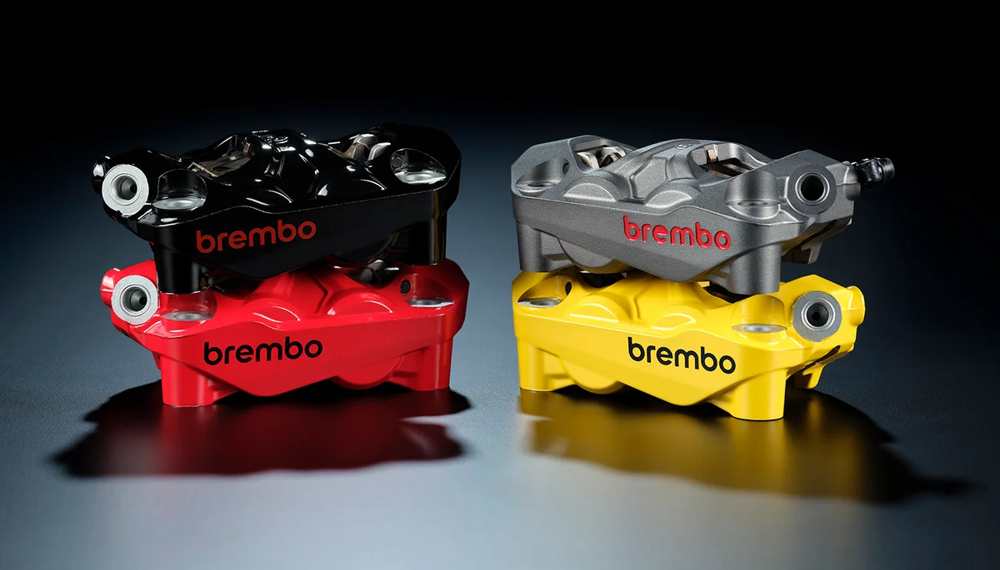

## Freinage

### Frein avant

La Ducati Panigale V4S est équipée de 2 disques semi-flottants de 330mm pincés par 2 étriers radiaux monobloc Brembo Hypure à 4 pistons avec Race eCBS. 

#### Etriers Radiaux monobloc Brembo Hypure
Lancés officiellement en 2023, introduits en production en 2024, les étriers Hypure ont fait leurs débuts en équipement d'origine sur la nouvelle Ducati Panigale V4 2025.

Les étriers Brembo Hypure se distinguent par leur design asymétrique révolutionnaire, une première dans l'histoire de la marque italienne. Cette approche conceptuelle inédite permet d'atteindre une réduction de poids de 10% (30 g) par rapport aux étriers de référence pour la même application comme les Stylema, faisant du Hypure l'étrier le plus léger de sa catégorie.

Le nom "Hypure" lui-même reflète l'esprit innovant de Brembo, fusionnant les termes "Hyper" et "Pure" pour exprimer les performances supérieures et la conception rationnelle de l'étrier.

Les étriers Hypure utilisent la technologie monobloc éprouvée de Brembo, fabriqués à partir d'un seul bloc d'aluminium grâce à un processus de coulée avancé.

Les étriers Hypure intègrent quatre pistons de 30 mm de diamètre avec un espacement radial standard de 100 mm. Cette configuration assure une compatibilité optimale avec les systèmes existants tout en offrant une puissance de freinage supérieure . Il est recommandé de les associer à un maître-cylindre de 17 mm tel que le Brembo RCS 17 ou le RCS 17 Corsa Corta pour une performance optimale.

Le Hypure intègre un système unique de ressort/plaquette/goupille basé sur une conception brevetée. Cette innovation, associée à une surface d'appui spécialement conçue entre l'étrier et la plaquette, minimise le couple résiduel et optimise le contact avec le disque.

Les étriers Hypure utilisent des plaquettes spécifiques, disponibles en différentes compositions selon l'usage. Les plaquettes Z04 Racing sont destinées à un usage strictement piste avec un prix d'environ 170-190€ par étrier, tandis que les plaquettes Z03 Endurance offrent une durabilité exceptionnelle pour les courses d'endurance .

### Frein arrière

- Maitre cylindre autopurgeur.

Disque de 245mm, étrier 2 piston avec Race eCBS.

### Ducati Brake Light (DBL)

En cas de freinage brusque en partant d'une vitesse supérieure à 55 km/h, le feu arrière clignote rapidement afin d'avertir les véhicules à larrière. Lorsque la décélération diminue en dessous d'un seuil prédéfini, le clignotement est automatiquement désactivé.

### Race eCBS

Développé par Bosch en collaboration avec Ducati, ce système de freinage combiné avec la fonctionnalité Cornering peut appliquer de manière autonome une pression de freinage à l'arrière, selon des stratégies prédéfinies, lorsque le pilote active le contrôle avant. Sur circuit, le système intervient comme pour les pilotes professionnels, tandis que la sécurité et la stabilité sont renforcées lors de l'utilisation sur route.

Le système Race eCBS applique une force de freinage à l'arrière à chaque fois que le frein avant est activé, en fonction de l'angle d'inclinaison de la moto et de la charge arrière et, dans le cas du réglage le plus sportif, continue d'intervenir même lorsque le pilote relâche le frein avant, la fonction dite « post run », reproduisant ce que font les pilotes professionnels pour resserrer la trajectoire et stabiliser la moto afin qu'elle tienne mieux la ligne dans les virages.

## Système Anti-Blocage des Freins (Anti-Lock Braking System - ABS)

L'ABS équipant la moto est un système de sécurité qui prévient le blocage des roues lors du freinage en adoptant des stratégies différentes selon le niveau sélectionné. L'ABS offre sept niveaux d'intervention, chacun associé à un Riding Mode.

Le tableau suivant indique le niveau d'intervention du système ABS le plus approprié aux divers types de conduite et les niveaux de Riding Modes programmés par défaut qui peuvent être sélectionnés par l'utilisateur.

| NIVEAU ABS | TYPE DE CONDUITE   | SURFACE    | ACTIVE     | CBS | CARACTÉRISTIQUE DE FONCTIONNEMENT                                                                                  | LIFT-UP CONTROL                                                                                                                                                                                   | PAR DÉFAUT |
| ------------ | -------------------- | ------------ | ------------ | ----- | --------------------------------------------------------------------------------------------------------------------- | --------------------------------------------------------------------------------------------------------------------------------------------------------------------------------------------------- | ------------- |
| 1          | TRACK PRO COMBINED | TRACK      | FRONT      | ON  | pilotes experts                                                                                                     | DISABLED if cornering function is active.                                                                                                                                                         | RACE A      |
| 2          | TRACK PRO          | TRACK      | FRONT      | OFF | pilotes experts                                                                                                     | Le système avec NE contrôle PAS le lift-up si la fonction cornering est active.                                                                                                                 |             |
| 3          | TRACK COMBINED     | WET TRACK  | FRONT      | ON  | piste humide pour pilotes experts                                                                                   | Le système NE contrôle PAS le lift-up si la fonction cornering est active. Ce niveau est également adapté à une utilisation sur piste avec les pneus Rain Pirelli SC1R.                      | RACE B      |
| 4          | TRACK              | WET TRACK  | FRONT      | OFF | piste humide pour pilotes experts                                                                                   | Le système NE contrôle PAS le lift-up si la fonction cornering est active. Ce niveau est également adapté à une utilisation sur piste avec les pneus Rain Pirelli SC1R.                      |             |
| 5          | SLIDE BY BRAKE     | TRACK/ROAD | FRONT/BACK |     | Ce niveau favorise la puissance de freinage et est conçu pour l'usage sur piste en conditions de bonne adhérence. | la fonction cornering est active. Le système avec ce niveau sélectionné, NE contrôle PAS le lift-up. Avec ce niveau sélectionné, est actif aussi le contrôle du slide pendant le freinage. |             |
| 6          | ROAD SPORT         | ROAD       | FRONT/BACK | ON  | route en conditions de bonne adhérence                                                                             | fonction cornering active, fonction de contrôle du lift-up active                                                                                                                                | ROAD, SPORT |
| 7          | ROAD SAFE & STABLE | ROAD       | FRONT/BACK | ON  | Standard                                                                                                            | fonction cornering active, fonction de contrôle du lift-up active        
