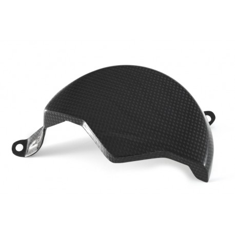

# Protections d'Alternateur
# CNC Racing
### CNC Racing - Protection carter alternateur
- reference": "PES02B",
- "prixmoyeneur": "120",
 - "lienficheproduit": "https://www.cncracing.com/en/ducati/panigale-v4-s-2025",
-    "remarques": "Aluminium taillé masse, protection crash"
### CNC Racing Protection carter allumage",
- reference": "PES03B",
    "homologation": "Route",
    "prixmoyeneur": "120",
    "compatibilitesellepassager": "true",
    "lienficheproduit": "https://www.cncracing.com/en/ducati/panigale-v4-s-2025",
    "remarques": "Aluminium taillé masse, protection crash"
  },
## FullSix
### FullSix - Alternator Protector
- **Reference**: `MD-V418-M75`
- **Prix Moyen**:  118 €
- [Fiche Carbon4US](https://www.carbon4us.com/en/carbono/8145-fullsix-camshaft-cover-for-ducati-panigale-v4.html)
- Entirely made of carbon fibre of premium quality, this part replaces the original, while enhancing both aesthetics and performances of the bike

  

