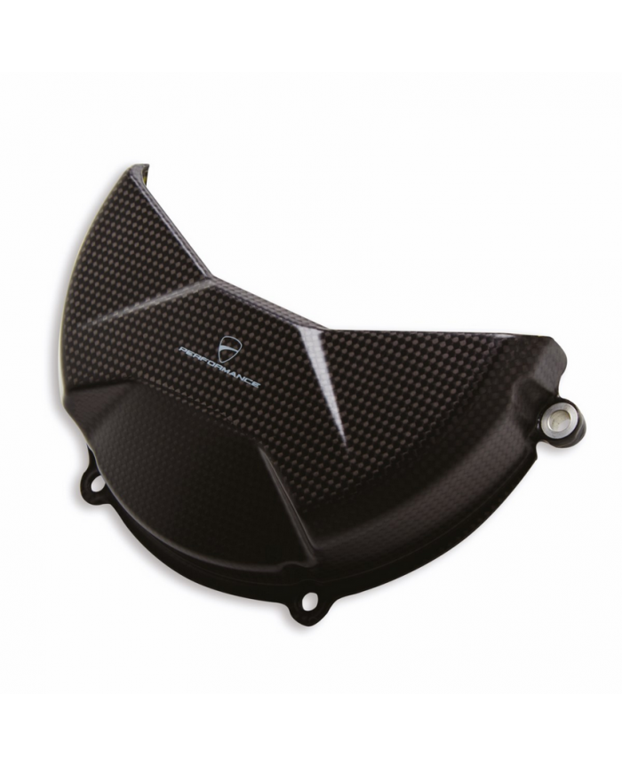
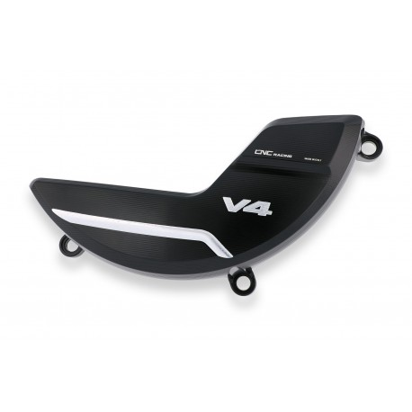
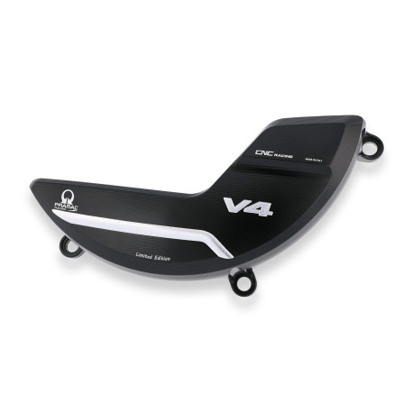
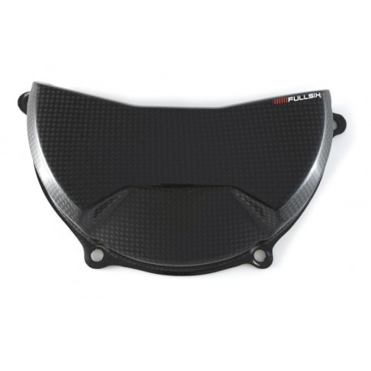

# Protections d’embrayage et couvercles pour Ducati Panigale V4 S 2025
## Ducati Performance  
### Ducati Performance – Protection carter embrayage carbone
- **Référence** : 96981071B
- **Homologation** : Route/Piste
- **Prix moyen** : 297 €
- **Lien** : [Voir la fiche produit](https://www.ducatigrenoble.com/protection-carter-embrayage-carbone-ducati-panigale-v4-2025.html)
- La légèreté et la résistance des fibres de carbone et des fibres d'aramide sont combinées à un design attrayant et à une finition typiquement racing dans un accessoire qui offre une protection maximale en cas de glissade et exalte l'âme sportive et élégante de la Panigale.
Non compatible avec l'embrayage à sec.

  
## CNC Racing
### CNC Racing – Protection carter embrayage
- **Référence** : PR310BS
- **Homologation** : Route/Piste
- **Prix moyen** : 185,64 €
- **Lien** : [Voir la fiche Carbon4US](https://www.carbon4us.com/en/embrague/7589-cnc-racing-clutch-cover-for-panigale-v4.html?_gl=1*8xy9pz*_up*MQ..*_ga*NTk4NDU2NDUuMTc0OTMyNTI1Mg..*_ga_YMQWVJL8P0*czE3NDkzMjUyNTEkbzEkZzEkdDE3NDkzMjUzMzAkajQ1JGwwJGgxMDU1NDMyMQ..)

### CNC Racing – Couvercle d’embrayage ajouré carbone
- **Référence** : PR310BPR
- **Homologation** : Route/Piste
- **Prix moyen** : 219,30 €
- **Lien** : [Voir la fiche produit](https://www.carbon4us.com/en/embrague/8141-ducati-v4-pramac-edition-clutch-cover.html?_gl=1*md6tp*_up*MQ..*_ga*NTk4NDU2NDUuMTc0OTMyNTI1Mg..*_ga_YMQWVJL8P0*czE3NDkzMjUyNTEkbzEkZzEkdDE3NDkzMjUzNTckajE4JGwwJGgxMDU1NDMyMQ..)
  

# FullSix
## FullSix
### FullSix - FullSix clutch cover for Ducati Streetfighter-Panigale V4
- **Référence** :  MD-V418-C72
- **Homologation** : Route/Piste
- **Prix moyen** : 114 €
Available in glossy or matte finish.

