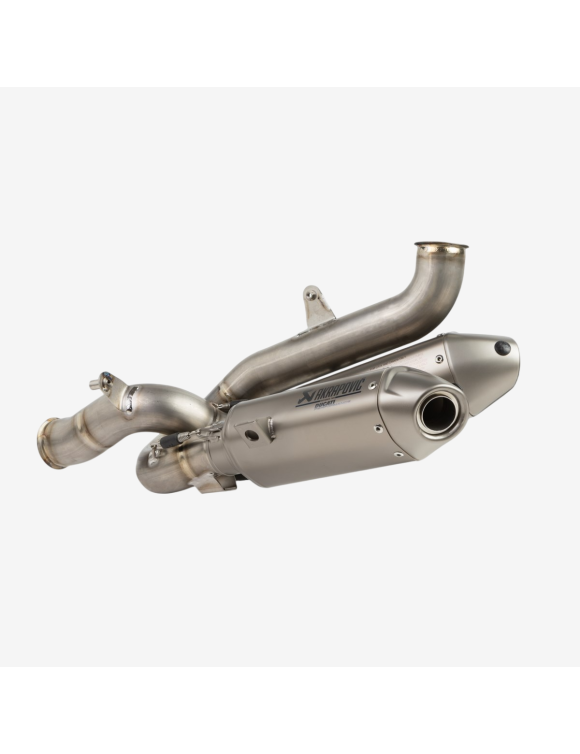
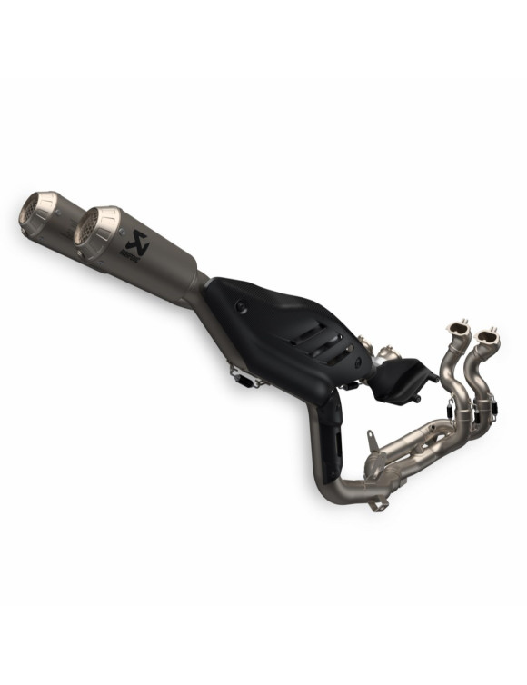

# Echappements

Vis # 2 M5x10
## Akrapovic
### Échappement Ducati by Akrapovic Euro5+ 
- **SKU**: **96482331AA**
- **Homologation**: Route et Circuit
- **Biplace**:
- **Poids**:
- **Gain CV **:
- **Gain NM **:
- **Volume Sonore**:
- **Prix €**: 6 998,40 €
- [Fiche Produit](https://shop.ducatimilano.com/fr/312396-ccc.html?id_currency=1&id_country=37)

### [Échappements Racing Ducati Performance Slip On]() - [Vidéo Son](https://www.reddit.com/r/Ducati/comments/1ik06m7/2025_ducati_panigale_v4_stock_exhaust_vs/?tl=fr) 
- **SKU**: **96482341AA**
- **Homologation**: Circuit Uniquement
- **Biplace**: Biplace
- **Poids**: -6kg
- **Gain CV **: +8cv
- **Gain NM **: +3.4Nm
- **Volume Sonore**:
- **Prix €**: 3 300 €
- [Fiche Ducati Milaon](https://shop.ducatimilano.com/fr/312397-silencieux-racing-96482341aa-ducati-panigale-v4.html?id_country=8)
- [Fiche Carbon4Us](https://www.carbon4us.com/fr/echappement/587198-echappements-racing-ducati-performance-par-akrapovic-panigale-v4-2025.html?_gl=1*a35hv1*_up*MQ..*_ga*MTMxMDk3NTY5OS4xNzQ2NzM2MjQw*_ga_YMQWVJL8P0*czE3NDY3MzYyMzkkbzEkZzEkdDE3NDY3MzYyNDkkajAkbDAkaDcxNjgwODY1Ng)
-  À combiner avec la cuve inférieure (96981931AA) ou aux carénages pour échappements racing (97181321AA).
-  Non homologué sur route ouverte, cartographie à faire modifier en concession
  

### Ligne d'Échappement Racing en Titane 
- **SKU**: **96482351BA**
- **Homologation**: Circuit Uniquement
- **Biplace**: Monoplace
- **Poids**:  -6.6kg
- **Gain CV **: +12cv
- **Gain NM **:  +7Nm 
- **Volume Sonore**:  107db 105db avec Chicane
- **Prix €**: 7 208,35 €

### SC Project
[Youtube 1](https://www.youtube.com/watch?v=0-bqUD-j3RA) 
- **Homologation**: Circuit

## Arrow
### Works
- **SKU**: 71163PK
- **Homologation**: 
- **Prix €**:

### Full Works -[Fiche Produit](https://www.arrow.it/fr/assembled/1911/Ducati-Panigale-V4-2025)

Circuit

## Termignoni
### LIGNE D' ECHAPPEMENT TERMIGNONI SBK D231[Fiche Produit](https://termignoni.store/fr/echappements-termignoni-ducati-panigale-v4-s-2025/1380-ligne-termignoni-ducati-panigale-v4-2025.html)                                  - **SKU**: **D23109400ITC**
- **Homologation**:  Circuit
-  Monoplace   
- **Prix €**:  4,968.00€ TTC

  
## Spark
### LIGNE D' ECHAPPEMENT TITANE SPARK DYNO RACING -[Fiche Desmo Racing](https://www.desmo-racing.com/ligne-echappement-titane-spark-dyno-racing-ducati-panigale-v4-2025-gdu8854t-xml-447_773-8669.html) 
GDU8854T
- **Homologation**: Circuit  
- **Prix €**: 8,314.00€ TTC

