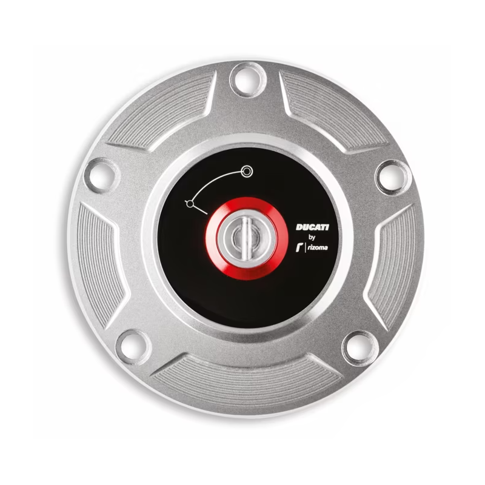
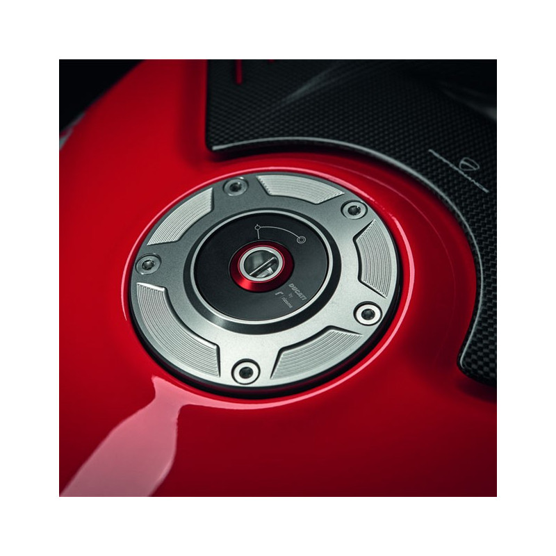
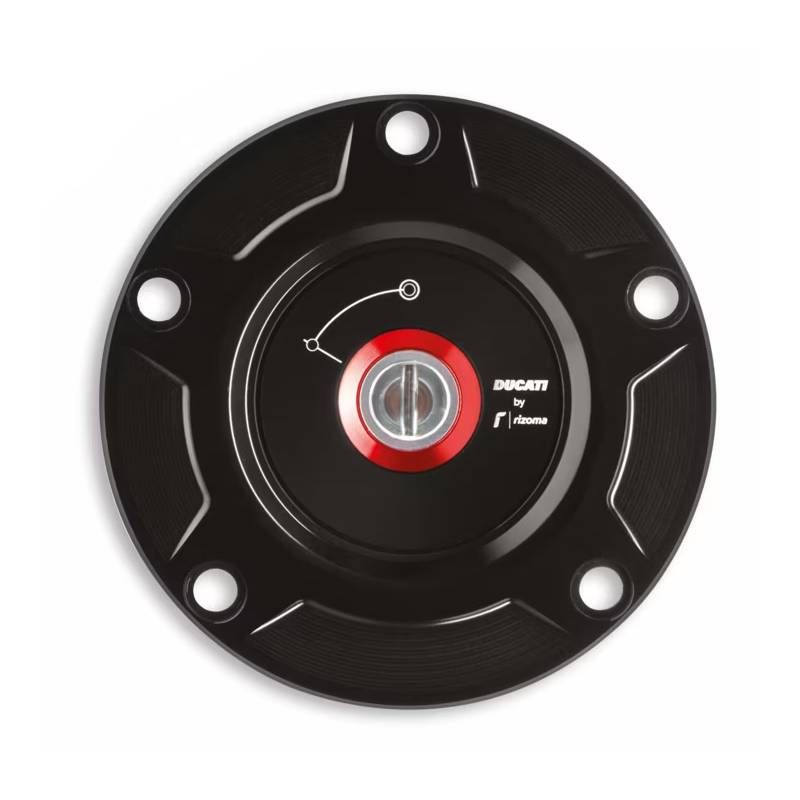
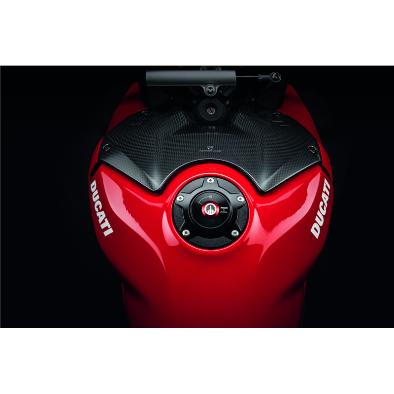
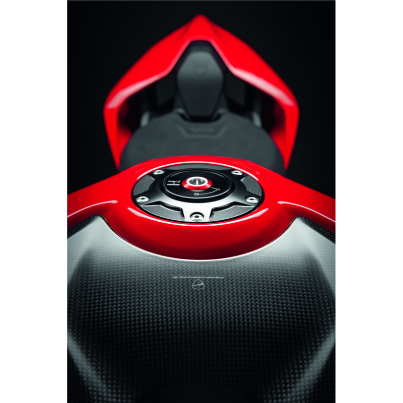

# Bouchons de Réservoir à Essence
## CNC Racing
### CNC Racing - Bouchon de réservoir essence à ouverture rapide.
- **Référence**: TF511B
- **SKU Original**: 89520411AE
- **Homologation**: Route
- **Prix moyen (EUR)**: 110
- **Lien fiche produit**: [Voir produit](https://www.cncracing.com/en/ducati/panigale-v4-s-2025)
- **Remarques**: Bouchon racing, ouverture sans clé
- 
### CNC Racing - Bouchon de réservoir GEAR
- **Référence**: TSB11
- **SKU Original**: 89520411AE
- **Lien fiche produit**: [Voir produit](https://www.desmo-racing.com/bouchon-reservoir-dessence-gear-cnc-racing-ducati-tsb11-xml-360_379-3518.html)
- **Remarques**: Bouchon de réservoir essence type 'GEAR' en aluminium taillé masse, finition anodisée, fabrication CNC Racing Made in Italy, compatible Panigale V4 S 2025.

## Ducati Performance by Rizoma
### Bouchon de réservoir Aluminium
- **Référence**: 97780051BB
- **SKU Original**: 
- **Prix moyen (EUR)**: 298.84
- **Lien fiche produit**: [Voir produit](https://www.carbon4us.com/fr/detachees-et-consommables/7666-bouchon-de-reservoir-ducati-performance.html)
- **Remarques**: Bouchon de réservoir officiel Ducati Performance en aluminium usiné, design exclusif Rizoma, livré avec clé spéciale Ducati, haute résistance et durabilité.
  

### Ducati Performance - Bouchon de réservoir Noir
- **Référence**: 
- **SKU Original**: 97780051BA
- **Prix moyen (EUR)**: 298.84
- **Lien fiche produit**: [Voir produit](https://www.carbon4us.com/fr/detachees-et-consommables/10017-bouchon-de-reservoir-noir-ducati-performance.html)
- **Remarques**: Version noire du bouchon de réservoir Ducati Performance, aluminium usiné, design Rizoma, livré avec clé spéciale Ducati.

## Lightech
### Lightech - Bouchon de réservoir à vis
- **Référence**: TFN229
- **SKU Original**: 89520411AE
- **Volume sonore (dB)**: n/a
- **Compatibilité selle passager**: n/a
- **Lien fiche produit**: [Voir produit](https://www.wrs.it/fr/bouchon-reservoir-essence/466318-coupa-ducati-panigale-v4-2025-8052393418353.html)
- **Remarques**: Nouveau bouchon de réservoir essence en aluminium CNC pour Ducati Panigale V4 S 2025, système de fermeture à vis sans clé, disponible en plusieurs couleurs, design élégant et fonctionnel.
