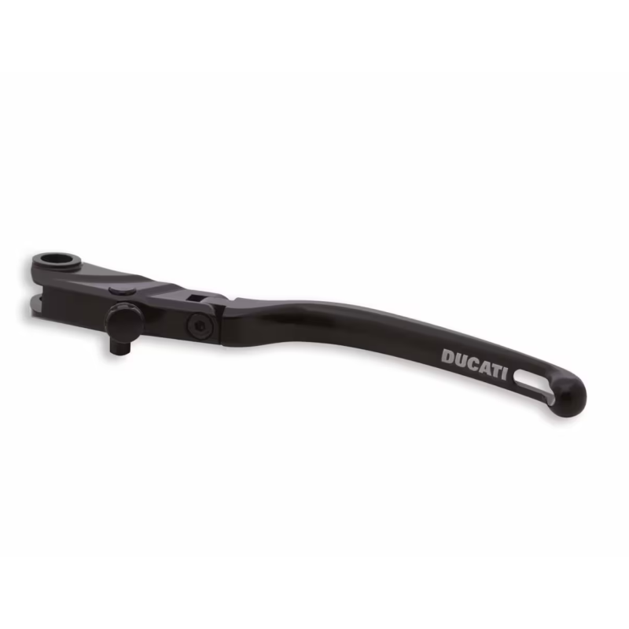
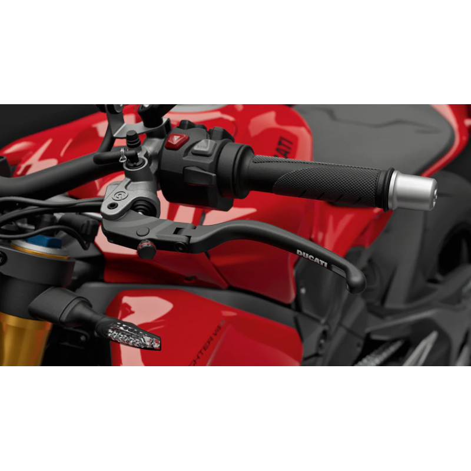

# CNC Racing

## Clutch Lever Race EVO Folding Glossy Carbon for Brembo semi-radial master cylinders
- Black: LCV12KB 
- Red: LCV12KR 

## Clutch Lever Race EVO Folding Matt Carbon for Brembo semi-radial master cylinders
- Black: LCV12YB 
- Red: LCV12YR

## Clutch lever RACE EVO Folding For Brembo Semi-Radial Master Cylinders
- Black/Black: LCV12BB 
-  Black/Red
LCV12BR 
-  Red/Black
LCV12RB 

## Clutch lever folding Red Race - Carbon
- Glossy: LCR12KR 
- Matte: LCR12YR 

# Ducati Performance

## Ducati Performance - Leviers embrayage réglables
- reference": "96180771AA",

  
# Rizoma
## Rizoma - 3D
- reference": "LBJ700B / LBJ701B",
- Homologation: Route/Piste
- Prix Myeneur": "180",
-  lienficheproduit": "https://www.rizoma.com/fr/ducati/panigale-v4-s-2025",
- Aluminium taillé masse"
