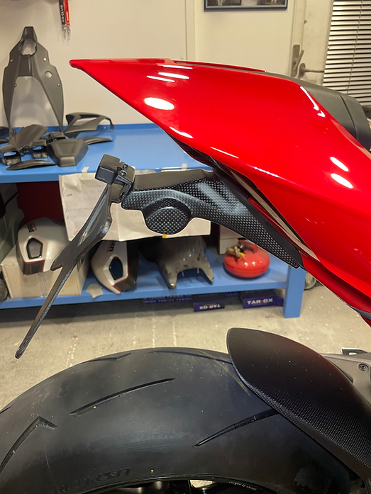
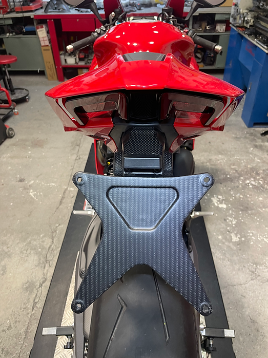
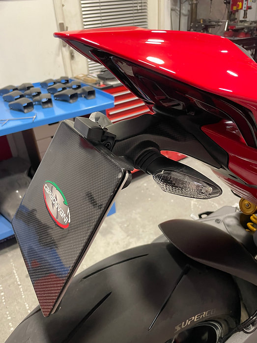

# Support de plaque
## Carbonvani
### Carbonvani – Support de plaque carbone
- **Référence** : DV4S25-30
- **Homologation** : Oui
- **Prix moyen (EUR)** : 300.00
- **Compatibilité selle passager** : Oui
- **Lien fiche produit** : [Voir produit](https://www.carbonvani.com/en/product-page/porta-targa-9)
- **Remarques** : Look racing, poids réduit, homologué route.

## CNC Racing
### CNC Racing – Support de plaque Racing
- **Référence** : PT210B
- **Homologation** : Route
- **Prix moyen (EUR)** : 140
- **Compatibilité selle passager** : true
- **Lien fiche produit** : [Voir produit](https://www.cncracing.com/en/ducati/panigale-v4-s-2025)
- **Remarques** : Aluminium, léger, clignotants compatibles

## Ducati Performance 
### Ducati Performance – Pack Sport V4 2025
- **Référence** : 97981431AA
- **Homologation** : Route
- **Prix moyen (EUR)** : 228.00
- **Compatibilité selle passager** : true
- **Lien fiche produit** : [Voir produit](https://www.carbon4us.com/fr/detachees-et-consommables/587203-pack-d-accessoires-sport-ducati-performance-panigale-stf-v4-2025.html)
- **Remarques** : Support carbone + détails aluminium anodisé, compatible Panigale V4/S 2025

### Ducati Performance – Support de plaque carbone
- **Référence** : 97381281A
- **Homologation** : Route
- **Prix moyen (EUR)** : 270
- **Compatibilité selle passager** : true
- **Lien fiche produit** : [Voir produit](https://shop.ducati.com/fr/fr/accessoires/97381281A)
- **Remarques** : Support de plaque allégé, carbone

## Evotech Performance
### Evotech Performance – Support de plaque court

- **Catégorie** : Carénage
- **Type de pièce** : Support de plaque
- **Marque** : Evotech Performance
- **Modèle** : Support de plaque court
- **Référence** : PRN014878-01
- **Homologation** : Route
- **Prix moyen (EUR)** : 180
- **Volume sonore (dB)** : N/A
- **Compatibilité selle passager** : true
- **Lien fiche produit** : [Voir produit](https://evotech-performance.com/products/ep-tail-tidy-ducati-panigale-v4-v4s-v4r)
- **Chicanes amovibles** : false
- **Remarques** : Inclut support clignotants et éclairage LED

## Rizoma
### Rizoma – Fox Panigale V4 2025
- **Référence** : RIZ-FOX-V4-2025
- **Homologation** : Route
- **Prix moyen (EUR)** : 299
- **Volume sonore (dB)** : N/A
- **Compatibilité selle passager** : true
- **Lien fiche produit** : [Voir produit](https://www.sport-classic.com/14666-top-bike-ducati-panigale-v4-2025)
- **Chicanes amovibles** : false
- **Remarques** : Homologué, design racing
