# Support de plaque
## Carbonvani
### Carbonvani – Support de plaque carbone
- **Référence** : DV4S25-30
- **Homologation** : Oui
- **Prix moyen (EUR)** : 300.00
- **Compatibilité selle passager** : Oui
- **Lien fiche produit** : [Voir produit](https://www.carbonvani.com/en/product-page/porta-targa-9)
- **Remarques** : Look racing, poids réduit, homologué route.

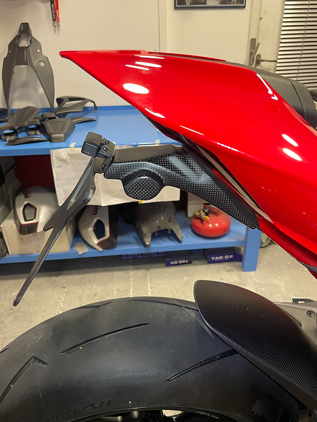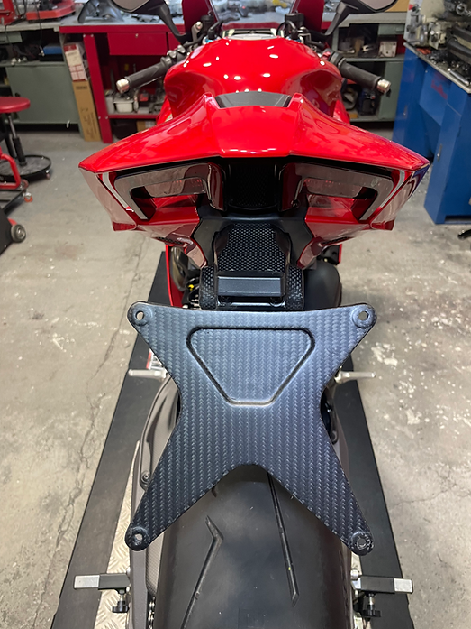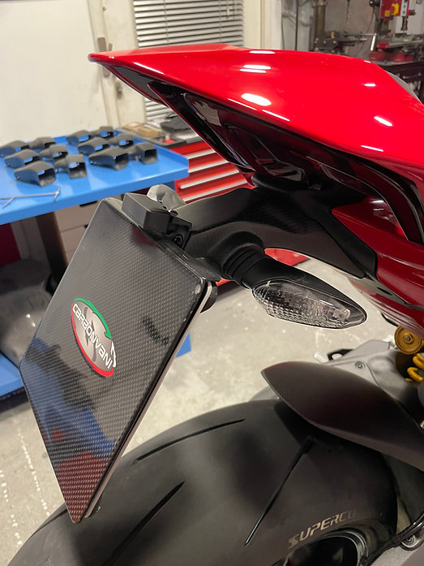

## Ducati Performance 
### Ducati Performance – Support de plaque carbone
- **Référence** : 97381281A
- **Homologation** : Route
- **Prix moyen (EUR)** : 270
- **Compatibilité selle passager** : true
- **Lien fiche produit** : [Voir produit](https://shop.ducati.com/fr/fr/accessoires/97381281A)
- **Lien fiche produit** : [Voir produit](https://www.carbon4us.com/fr/detachees-et-consommables/587203-pack-d-accessoires-sport-ducati-performance-panigale-stf-v4-2025.html)
- **Remarques** : Support carbone + détails aluminium anodisé, compatible Panigale V4/S 2025

## Evotech Performance
### Evotech Performance – Support de plaque court

- **Catégorie** : Carénage
- **Type de pièce** : Support de plaque
- **Marque** : Evotech Performance
- **Modèle** : Support de plaque court
- **Référence** : PRN014878-01
- **Homologation** : Route
- **Prix moyen (EUR)** : 180
- **Volume sonore (dB)** : N/A
- **Compatibilité selle passager** : true
- **Lien fiche produit** : [Voir produit](https://evotech-performance.com/products/ep-tail-tidy-ducati-panigale-v4-v4s-v4r)
- **Chicanes amovibles** : false
- **Remarques** : Inclut support clignotants et éclairage LED

## Rizoma
### Rizoma – Fox Panigale V4 2025
- **Référence** : PT546B
- **Homologation** : Route
- **Prix moyen (EUR)** : 299
- **Compatibilité selle passager** : true
- **Exhaust Compatibility** : Le support de plaque d'immatriculation Rizoma PT546B n'est pas compatible avec Ensemble échappement complet en titane Akrapovic® (Ref. Ducati 96482351BA). Il est en revanche compatible avec Silencieux racing Akrapovic® (Ref. Ducati 96482341AA) et Silencieux Akrapovic® (Ref. Ducati 96482331AA).
- **Product Links** : [See Rizoma product page PT546B](https://cycle.rizoma.com/fr/negozio/support-dimmatriculation/PT546/kit-support-dimmatriculation-fox-pt546/motorbike/18151/ducati/panigale-v4)

Réalisé en aluminium, chaque kit support d’immatriculation Fox est spécifiquement conçu pour le modèle de moto auquel il est destiné. Il s’intègre ainsi à la perfection à la ligne de la moto et rend en outre l’installation facile et rapide. En effet, chaque kit est fourni avec tout le matériel nécessaire pour un montage qui ne requiert aucune modification aux composants OEM. Une grande fonctionnalité et des dimensions extrêmement réduites, toujours en conformité avec les normes réglementaires. Les kits Fox comprennent l’éclairage de plaque d’immatriculation à LED SMD et les supports pour clignotants Rizoma. Ils sont réglables et fournis avec un arrêt de sécurité, pour garantir une inclinaison correcte.

Kit avec support de plaque 173x173 mm, support de plaque USA 166x89,5 mm, supports pour clignotants Rizoma, éclairage de plaque d’immatriculation à LED SMD (homologué) et catadioptre.

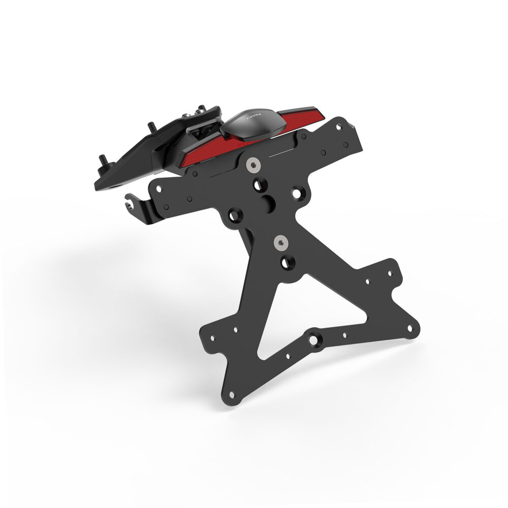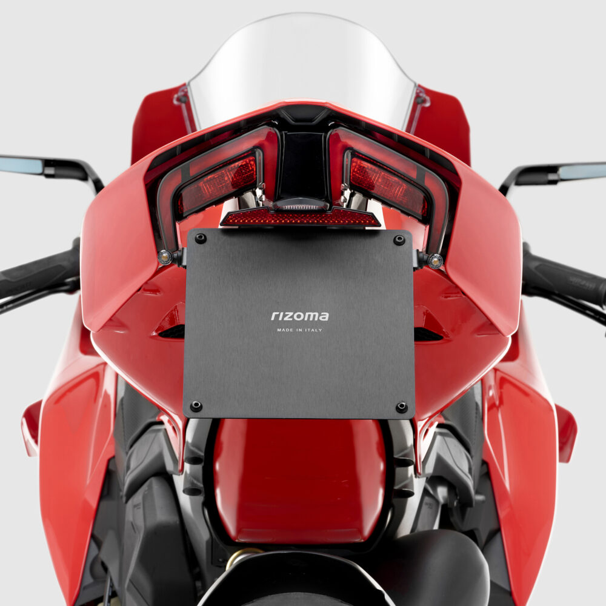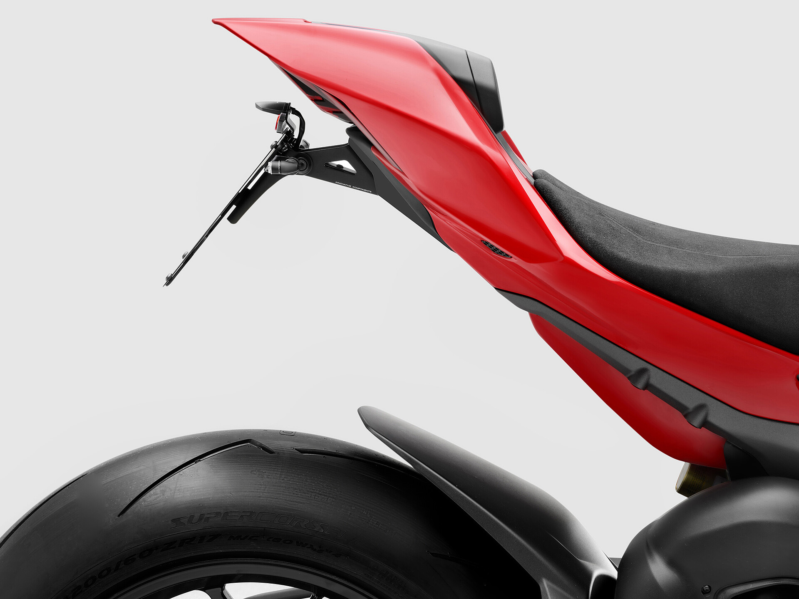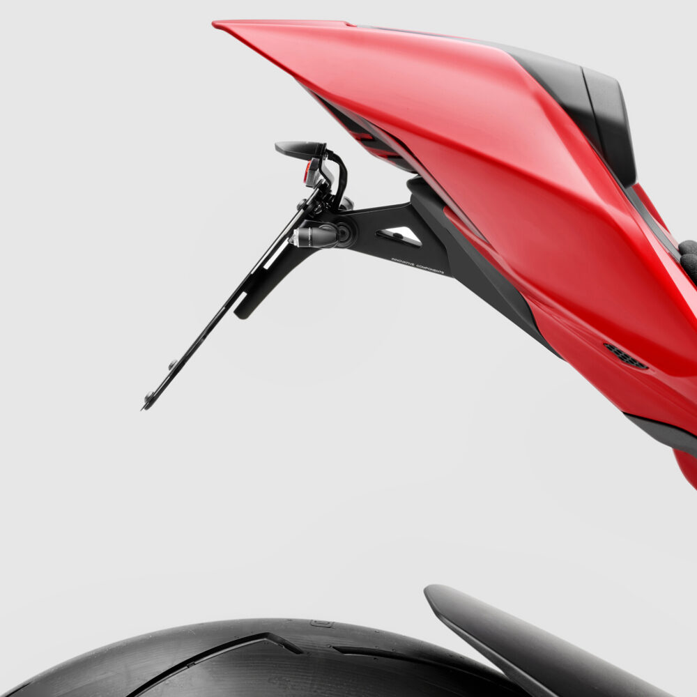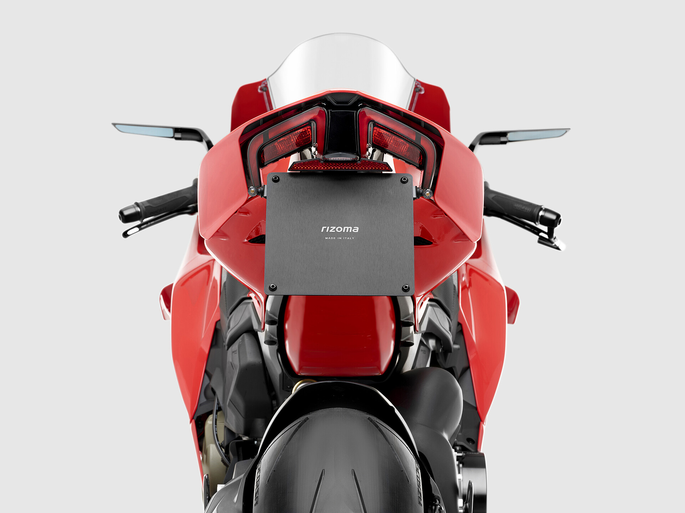

### Rizoma – Fender Eliminator USA
- **Référence** : PTU014
- **Homologation** : Route USA
- **Prix moyen (EUR)** : n/a
- **Exhaust Compatibility** : Le support de plaque d'immatriculation Rizoma PT546B n'est pas compatible avec Ensemble échappement complet en titane Akrapovic® (Ref. Ducati 96482351BA). Il est en revanche compatible avec Silencieux racing Akrapovic® (Ref. Ducati 96482341AA) et Silencieux Akrapovic® (Ref. Ducati 96482331AA).
- **Product Links** : [See Rizoma product page PTU014](https://cycle.rizoma.com/fr/negozio/support-dimmatriculation/PTU014/flat-out-fender-eliminator-ptu014/motorbike/18151/ducati/panigale-v4/)

Issu d’un profond engagement envers la communauté motocycliste nord-américaine, Rizoma dévoile une nouvelle déclaration audacieuse d’excellence en design et d’innovation technologique : FLAT-OUT, le seul support d’immatriculation que vous voudrez sur votre moto.

Fabriquée en Italie, cette nouvelle icône redéfinit les règles du design de l’arrière de la moto, alliant harmonieusement esthétique épurée et fonctionnalité lumineuse avancée à travers un accessoire unique qui affine les lignes de toute moto.

Sa barre lumineuse entièrement intégrée et multifonction regroupe l’éclairage de plaque et les clignotants séquentiels dans une unité compacte et minimaliste, commune à tous les modèles. La technologie LED la plus avancée, élégamment dissimulée derrière un verre fumé noir, offre des performances lumineuses grand angle irréprochables.

Animé par la quête de perfection, le support de plaque en aluminium est doté de fentes de montage et d’un profil ultra-fin pour réduire au maximum la masse non suspendue, tout en conservant un système léger et axé sur la performance.

Le nom du produit fait directement référence aux deux options de montage rendues possibles par les deux supports en aluminium fournis, offrant aux motards la liberté de choisir leur style préféré : “FLAT” pour une configuration plus intégrée et “OUT” pour une disposition standard.

Pour une expérience d’achat et de montage optimale, le Fender Eliminator FLAT-OUT est vendu en kit complet, avec toutes les résistances et le câblage inclus pour une installation véritablement Plug & Play.

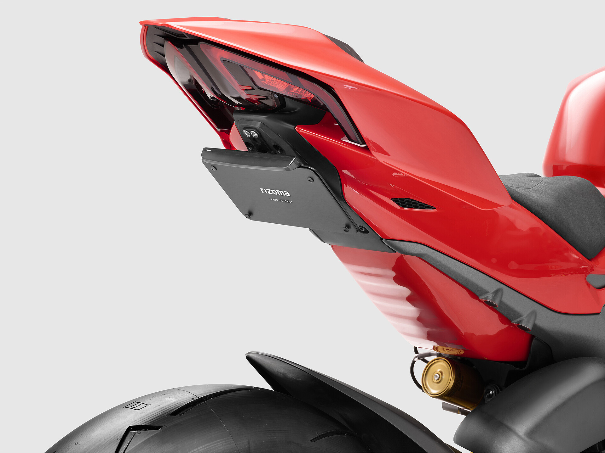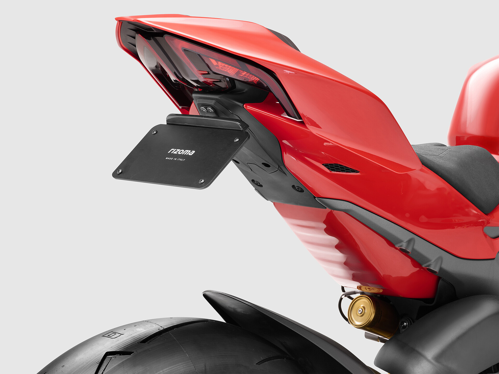

### MG BIKETEC – Support de Plaque Court
- **Référence** : 
- **Homologation** : Route
- **Prix moyen (EUR)** : 299
- **Lien fiche produit** : [Voir produit]()
- **Chicanes amovibles** : false
- **Remarques** : 

## CNC Racing
### CNC Racing - Support de plaque en carbone
- **Référence** : PT400Y
- **Homologation** : Route
- **Prix moyen (EUR)** : 330
- **Product Links** : [Carbon4US Page](https://www.carbon4us.com/fr/detachees-et-consommables/604404-support-de-plaque-en-carbone-cnc-racing-pour-ducati-panigale-v4-2025.html)

Le support principal est en fibre de carbone haute résistance et le support de plaque est en PA12 avec de la fibre de carbone, pour un poids total de seulement 290 grammes.

Son installation Plug & Play inclut un système de passage de câbles interne pour une finition propre. Le support de plaque a une inclinaison réglable, est livré avec un éclairage LED homologué et trois supports pour clignotants. De plus, sa trame de carbone est identique à celle des pièces Ducati Performance, ce qui garantit un aspect parfait.

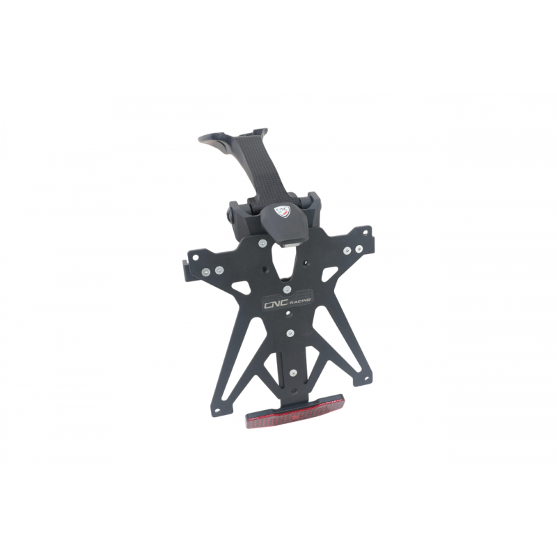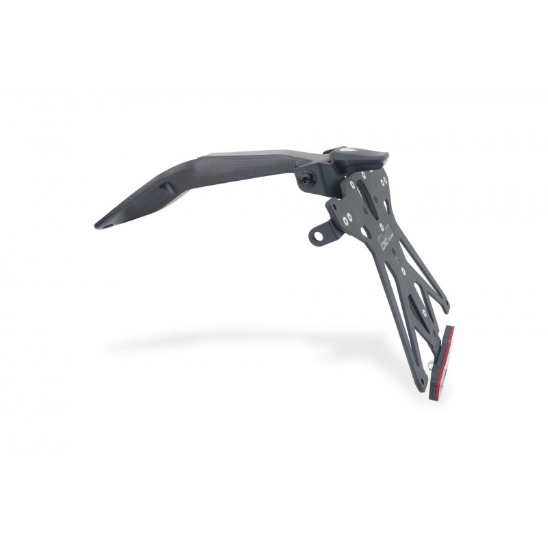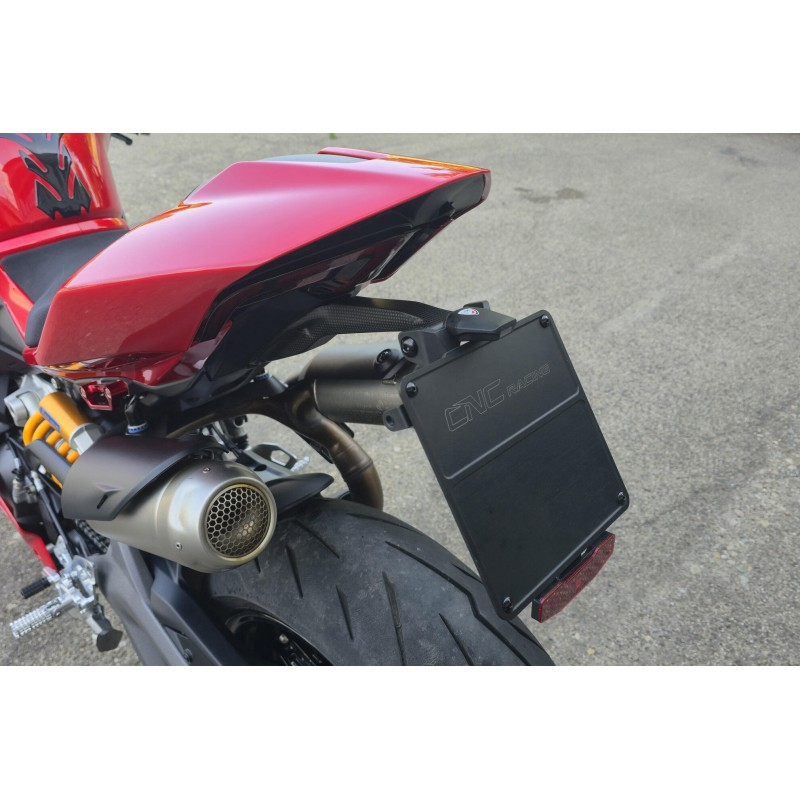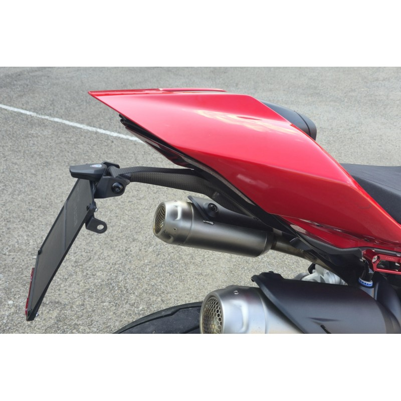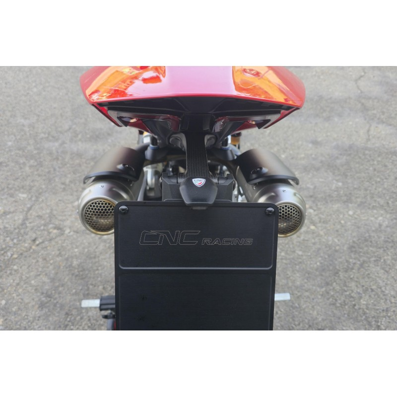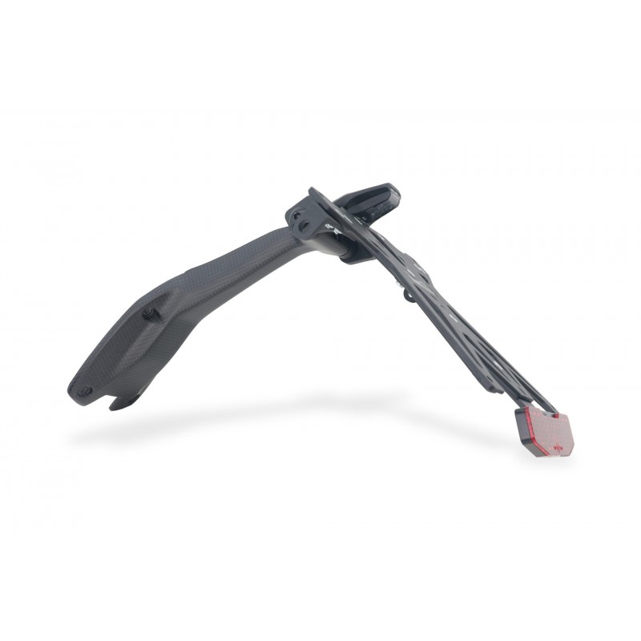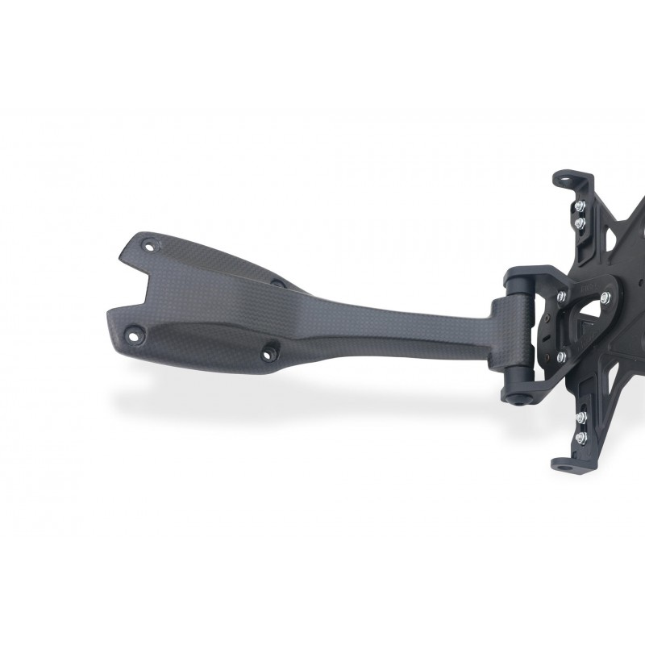
